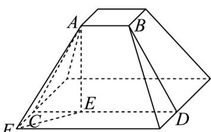

> [!faq]- 《专题02_棱柱_棱锥_棱台表面积与体积的六大常考题型_高效培优专项训练》官方解析
>
> > [!success]- **【答案】** $\frac{56}{3}\pi$
>
> > [!note]- **【分析】**
> > 设圆台上底面半径为 $r$ ，下底面半径为 $R$ ，母线长为 $l = 2\sqrt{2}$ ，根据上下底面面积关系求出 $R$ 与 $r$ 的关系，根据侧面积与上底面面积的关系求出 $r, R$ 的值，进而求出圆台的高及体积．
>
> > [!note]- **【解析】**
> > 设圆台上底面半径为 $r$ ，下底面半径为 $R$ ，母线长为 $l = 2\sqrt{2}$ 圆台下底面面积是上底面面积的4倍，可得 $\pi R^2 = 4\pi r^2$ ，所以 $R = 2r$ 圆台侧面积是上底面面积的 $3\sqrt{2}$ 倍，则 $\pi (R + r)l = 3\sqrt{2}\pi r^2$ 将 $R = 2r,l = 2\sqrt{2}$ 代入得 $\pi (2r + r)\times 2\sqrt{2} = 3\sqrt{2}\pi r^2$ ，即 $r^2 -2r = 0$ 因为半径 $r > 0$ ，所以 $r = 2$ ，那么 $R = 2r = 4$ 则圆台的高 $h = \sqrt{l^2 - (R - r)^2} = \sqrt{(2\sqrt{2})^2 - (4 - 2)^2} = 2$ 故圆台的体积为 $V = \frac{1}{3}\pi \times 2\times (4^{2} + 4\times 2 + 2^{2}) = \frac{56}{3}\pi$ 故答案为： $\frac{56}{3}\pi$
> >
> > 47．《九章算术》中将正四棱台称为“方亭”．现有一方亭，上底面边长为2，下底面边长为6，侧棱与下底面所成的角为 $\frac{\pi}{4}$ ，则此方亭的体积为（）
> >
> > 【答案】
> > A. $\frac{104\sqrt{2}}{3}$ B. $\frac{92\sqrt{2}}{3}$ C. $\frac{80\sqrt{2}}{3}$ D. $\frac{68\sqrt{2}}{3}$
> >
> > 【答案】A
> >
> > 【分析】根据题意找到侧棱与下底面所成的角，求出侧棱长，求出正四棱台的高即可求出此方亭的体积.
> > 【详解】如图，AC,BD分别是正四棱台不相邻两个侧面的高，AF是一条侧棱，
> > 过 A 作 $AE \perp CD$ ，连接 EF，
> >
> > 
> >
> > 所以 AE 是正四棱台的高，所以 $\angle AFE = \frac{\pi}{4}$ ，
> >
> > 因为 $EF = \sqrt{\left(\frac{6-2}{2}\right)^{2} + \left(\frac{6-2}{2}\right)^{2}} = 2\sqrt{2}$ ，所以 $AE = 2\sqrt{2}$ ，
> >
> > 所以方亭的体积为 $\frac{2\sqrt{2}}{3} (2^2 + 6^2 + \sqrt{2^2 \times 6^2}) = \frac{104\sqrt{2}}{3}$
> >
> > 故选 **A**.
