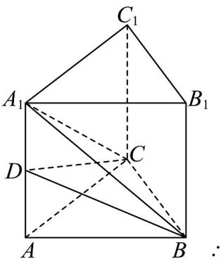

> [!faq]- 《专题02_棱柱_棱锥_棱台表面积与体积的六大常考题型_高效培优专项训练》官方解析
>
> > [!success]- **【答案】** A
>
> > [!note]- **【分析】**
> > 根据棱锥及棱柱的体积公式计算求解.
>
> > [!note]- **【解析】**
> > 如图所示， $\because$ 几何体 $ABC - A_{1}B_{1}C_{1}$ 为正三棱柱，且所有棱长均为 $\frac{2}{3}$
> >
> > 
> >
> > 底面 $ABC$ 为正三角形，侧面 为正方形，
> >
> > $$
> > B B _ {1} C _ {1} C
> > $$
> >
> > 则 $V_{\text{三棱锥}A_1 - BCD} = V_{\text{三棱柱}ABC - A_1B_1C_1} - V_{\text{四棱锥}A_1 - BB_1C_1C} - V_{\text{三棱锥}D - ABC}$
> >
> > $$
> > = \frac {1}{2} \times \frac {2}{3} \times \frac {\sqrt {3}}{3} \times \frac {2}{3} - \frac {1}{3} \times \frac {2}{3} \times \frac {2}{3} \times \frac {\sqrt {3}}{3} - \frac {1}{3} \times \frac {1}{2} \times \frac {2}{3} \times \frac {\sqrt {3}}{3} \times \frac {1}{3} = \frac {\sqrt {3}}{8 1}
> > $$
> >
> > 故选 **A**.
