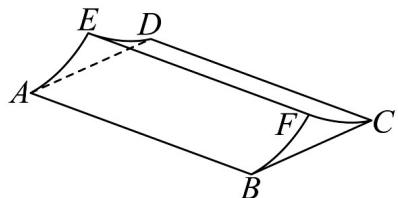
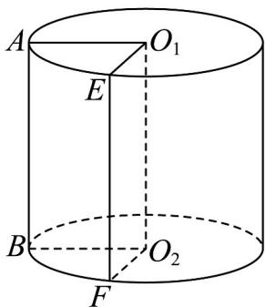
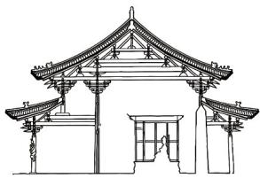
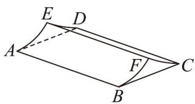
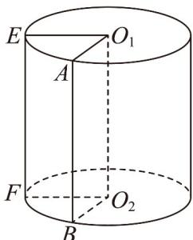

> [!faq]- 《专题03_圆柱_圆锥_圆台及球表面积与体积的五大常考题型_高效培优专项》官方解析
>
> > [!success]- **【答案】**  A. $\frac{200\pi}{3}\mathrm{m}^2$ B. $\frac{400\pi}{3}\mathrm{m}^2$ C. $200\pi \mathrm{m}^2$ D. $\frac{800\pi}{3}\mathrm{m}^2$
>
> > [!note]- **【分析】**
> > 将区域 ABFE 还原到圆柱中求得其面积，由区域 ABFE 和 DCFE 全等可求得总面积.
>
> > [!note]- **【解析】**
> > 由题意知区域 ABFE 和 DCFE 全等，且都是底面半径为 10 m，高为 40 m 的圆柱的侧面的一部分。
> >
> > 将区域 ABFE 还原到如图所示圆柱中，可知 $AO_{1}=10m$ ， $\angle AO_{1}E=\frac{\pi}{3}$ ，AB=40m。
> >
> > 由扇形的弧长公式可知， $AE=\angle AO_{1}E\times AO_{1}=\frac{\pi}{3}\times10=\frac{10\pi}{3}m$ ，
> >
> > 由圆柱的侧面积公式可知 $S_{ABFE}=\overline{AE}\times AB=\frac{10\pi}{3}\times40=\frac{400\pi}{3}m^{2}$ ，
> >
> > 所以 $S_{ABFE}+S_{DCFE}=2S_{ABFE}=\frac{800\pi}{3}m^{2}$ ，
> >
> > 所以被瓦片覆盖的区域 ABFE 和 DCFE 的总面积为 $\frac{800\pi}{3}m^{2}$ 。
> >
> > 故选：D.
> >
> > 
> >
> > 4．晋祠圣母殿是现存宋代建筑艺术的杰出代表，图1是该建筑的剖面图，圣母殿以其独特的木构技术、历史价值与艺术成就闻名，被誉为研究中国宋代建筑的“活标本”现使用图2简单模拟圣母殿的屋顶结构，其中四边形ABCD为矩形， $AB=20m$ ，AE，DE，BF，CF为四段全等的圆弧，其对应的圆半径为6m，圆心角为 $\frac{\pi}{3}$ ，已知区域ABFE和DCFE是被瓦片覆盖的区域则该模型中瓦片覆盖区域的总面积为\_\_\_\_。
> >
> > 【答案】
> >
> > 
> > 图1
> >
> > 
> > 图2
> >
> > 【答案】 $80\pi \mathrm{m}^2$
> >
> > 【分析】将区域 ABFE 还原到圆柱中，结合圆柱的侧面积公式求得其面积，再由区域 DCFE 和 ABFE 全等可求得总面积.
> >
> > 【详解】依题意，区域 ABFE 和 DCFE 全等，且都是底面半径为 6m，高为 20m 的圆柱的侧面的一部分，将区域 ABFE 还原到圆柱中，如图：
> >
> > 
> >
> > 由图可知 $AO_{1}=6$ ， $\angle AO_{1}E=\frac{\pi}{3}$ ，AB=20，
> >
> > 由扇形的弧长公式知， $\geqslant E$ 的长为 $\angle AO_{1}E \times AO_{1} = \frac{\pi}{3} \times 6 = 2\pi$ 由圆柱的侧面积公式知 $S_{ABFE} = \frac{1}{6}\times 2\pi \times 6\times 20 = 2\pi \times 20 = 40\pi$ ，则 $S_{ABFE} + S_{DCFE} = 2S_{ABFE} = 80\pi$ 所以被瓦片覆盖的区域 $ABFE$ 和 $DCFE$ 的总面积为 $80\pi \mathrm{m}^2$ 故答案为： $80\pi \mathrm{m}^2$
