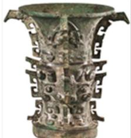
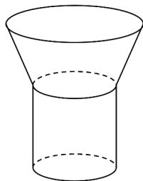
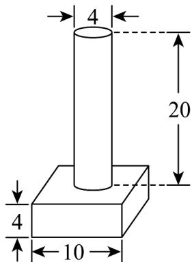
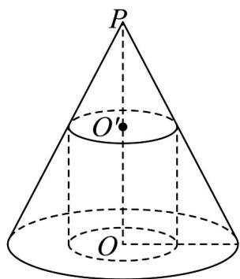

> [!faq]- 《专题03_圆柱_圆锥_圆台及球表面积与体积的五大常考题型_高效培优专项》官方解析
>
> > [!success]- **【答案】**   图1 图2 A. $6336\mathrm{cm}^3$ B. $6656\mathrm{cm}^3$ C. $6976\mathrm{cm}^3$ D. $7296\mathrm{cm}^3$
>
> > [!note]- **【分析】**
> > 结合圆柱的侧面积、体积公式，以及圆台的体积公式求解即可.
> >
> > $$
> > h _ {1}, h _ {2}
> > $$
> >
> > $$
> > r _ {1}, r _ {2}
> > $$
> >
> > 则由题意可得 $h_1 + h_2 = 38$ ， $r_1 = 14$ ， $r_2 = 10$
> >
> > 由题意， $2\pi r_{2}h_{2} = 1320$ ，得 $h_2 = 22$
> >
> > 所以 $h_1 = 38 - h_2 = 16$
> >
> > 故 $V_{\text{圆台}} = \frac{\pi}{3}\left(r_1^2 + r_2^2 + r_1r_2\right) \times h_1 = (196 + 100 + 140) \times 16 = 6976$
> >
> > 故选：C.
> >
> > 9．上海市实验学校的小明同学根据他的创新特需课题所需，设计了某零件并委托网络商家3D打印.零件下部是实心的正四棱柱，上部是实心的圆柱，如图所示（图中单位：cm）.
> >
> > 
> >
> > (1)已知 3D 打印材料的密度为 $1.3 \mathrm{~g} / \mathrm{cm}^{3}$ ，求打印一个这样的零件需要多少克材料？（四舍五入到整数克，不计其他损耗）
> >
> > (2)小明委托打印了5个该型零件，再对零件的表面（包含底面）喷漆油漆，若预计每平方厘米要用漆
> >
> > 0.12g（已计入可能的损耗），求小明需要购买每罐300克的喷漆共多少罐？
> >
> > 【答案】(1)847克；
> >
> > (2)2 罐.
> >
> > 【分析】（1）利用圆柱与棱柱的体积公式求出零件的体积，借助材料的密度求出材料的质量.
> >
> > (2) 利用圆柱与棱柱的表面积公式求出零件的表面积，即可得解.
>
> > [!note]- **【解析】**
> > （1）圆柱部分体积为 $V_{1} = \pi \times 2^{2}\times 20 = 80\pi$
> >
> > 正四棱柱部分体积为 $V_{2} = 10^{2}\times 4 = 400$ ，因此零件的体积为 $V = V_{1} + V_{2} = (80\pi +400)\mathrm{cm}^{3}$
> >
> > 而该 3D 打印材料的密度为 $1.3 \mathrm{~g} / \mathrm{cm}^{3}$
> >
> > 所以打印一件这样的零件需要 $(80\pi+400)\times1.3\approx847$ 克材料.
> >
> > 答：需要 847 克材料.
> >
> > (2) 此零件的表面积为 $S = 2\pi \times 2 \times 20 + 4 \times 10 \times 4 + 2 \times 10^{2} = (360 + 80\pi)$ （cm²），
> >
> > 则需要购买每罐 300 克的喷漆共 $\frac{(360+80\pi)\times5\times0.12}{300}\approx1.2$ ，显然 1.2>1，所以需要两罐。
> >
> > 答：需要2罐.
> >
> > 10．实心圆锥 $PO$ 的底面直径为6，高为4，过 $PO$ 中点 $O'$ 作平行于底面的截面，以该截面为底面挖去一个圆柱，如图所示，则剩下几何体的表面积是\_\_\_\_.
> >
> > 【答案】
> >
> > 
> >
> > 【答案】 $30\pi$
> >
> > 【分析】根据已知几何体的表面积为圆锥表面积与挖去圆柱侧面积的和，再应用圆柱、圆锥的侧面积和表面积求法求面积.
> >
> > 【详解】由题意，几何体的表面积为圆锥表面积与挖去圆柱侧面积的和，
> >
> > 又圆柱底面半径为 $\frac{3}{2}$ ，高为 $2$ ，则其侧面积为 $\pi \times 2 \times \frac{3}{2} \times 2 = 6\pi$
> >
> > 圆锥的母线长为 $\sqrt{4^2 + 3^2} = 5$ ，底面周长为 $6\pi$ ，则其表面积为 $\pi \times 3^2 + \frac{1}{2} \times 5 \times 6\pi = 24\pi$
> >
> > 所以几何体的表面积为 $30\pi$ .
> >
> > 故答案为： $30\pi$
> >
> > 题型二：圆锥表面积与体积
