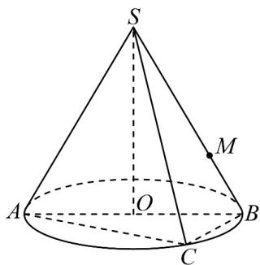
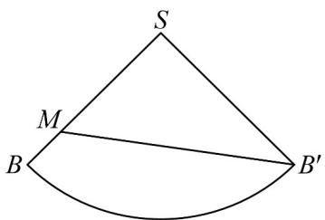

> [!faq]- 《专题03_圆柱_圆锥_圆台及球表面积与体积的五大常考题型_高效培优专项》官方解析
>
> > [!success]- **【答案】**  A. 该圆锥的体积为 $\sqrt{15}\pi$ B. 该圆锥的侧面展开图的圆心角大小为 $\frac{\pi}{2}$ C. 三棱锥 $S - ABC$ 的体积的最大值为 $\frac{\sqrt{15}}{3}$ D．若 BM=1 ，则从点 B 出发绕圆锥侧面一周到达点 M 的最短长度为 5
>
> > [!note]- **【分析】**
> > 利用扇形的侧面积公式求出圆锥的母线长，进而得出其高，结合锥体的体积公式可判断A选项；
> >
> > 根据扇形的弧长公式可判断B选项；求出VABC面积的最大值，结合锥体的体积公式可判断C选项；将圆锥沿着SB展开，结合勾股定理可判断D选项.
>
> > [!note]- **【解析】**
> > 对于 A 选项，设圆锥的母线长、底面半径、高分别为 l 、 r 、 h
> >
> > 由题知，圆锥的侧面积 $\pi rl = 4\pi$ ，所以 $l = 4$ ，圆锥高 $h = \sqrt{4^2 - 1^2} = \sqrt{15}$
> >
> > 故该圆锥的体积为 $V=\frac{1}{3}\pi\times1^{2}\times\sqrt{15}=\frac{\sqrt{15}\pi}{3}$ ，A 错；
> >
> > 对于 B 选项，侧面展开图弧长 $l' = 2\pi \times 1 = 2\pi$ ，圆心角 $\alpha = \frac{l'}{l} = \frac{2\pi}{4} = \frac{\pi}{2}$ ，B 对；
> >
> > 对于C选项，由圆的几何性质可知 $AC \perp BC$ ，由勾股定理可得 $AC^2 + BC^2 = AB^2 = 2^2 = 4$
> >
> > 由基本不等式可得 $4 = AC^{2} + BC^{2}$ $2AC \cdot BC$ ，故 $AC \cdot BC \leq 2$ ，
> >
> > 当且仅当 $\left\{ \begin{array}{l} AC = BC \\ AC^2 + BC^2 = 4 \end{array} \right.$ ，即当 $AC = BC = \sqrt{2}$ 时，等号成立，
> >
> > 此时 $S_{\triangle ABC} = \frac{1}{2} AC \cdot BC \leq 1$ ，故 $V_{S - ABC} = \frac{1}{3} S_{\triangle ABC} \cdot h \leq \frac{1}{3} \times 1 \times \sqrt{15} = \frac{\sqrt{15}}{3}$ ，C对；
> >
> > 对于D选项，由B选项知，侧面展开图扇形圆心角 $\alpha = \frac{\pi}{2}$
> >
> > 
> >
> > 点 $M$ 在 $SB$ 上且 $BM = 1$ ，则 $SM = SB - BM = 3$
> >
> > 展开后的扇形中， $B^{\prime}$ 与 $_B$ （对应底面同一点）的圆心角为 $\frac{\pi}{2}$ 最短路径为线段 $B'M$ ，且 $B'M = \sqrt{SM^{2} + SB^{2}} = \sqrt{4^{2} + 3^{2}} = 5$ ，D 对.
> >
> > 故选 **BCD**.
