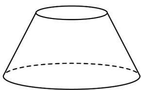
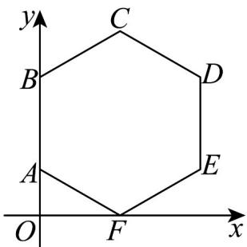

<!-- question-source:start -->
24．（1）如图1，设圆台的上、下底面的面积分别为 $S_{1},S_{2}$ ，高为h，根据圆锥的体积，证明：圆台的体积 $V=\frac{1}{3}\left(S_{1}+\sqrt{S_{1}S_{2}}+S_{2}\right)h$

(2) 如图 2，在平面直角坐标系 $xOy$ 中，多边形 $ABCDEF$ 的顶点 $A(0,1), B(0,3)C(\sqrt{3},4)$ ，若该多边形是正六边形，写出点 $D, E, F$ 的坐标并求该六边形绕 $y$ 轴旋转一周形成的几何体 $\Omega$ 的体积；

(3) 在 (2) 的条件下，求几何体 $\Omega$ 的表面积.

图1

图2
<!-- question-source:end -->

![[高中/课堂同步/题库/人教A版高中数学同步讲义(2026)/02_必修第二册/第八章 立体几何初步/专项训练/专题03_圆柱_圆锥_圆台及球表面积与体积的五大常考题型_高效培优专项/题型三_sec_03/questions/answers/Q00065041A1.md]]
