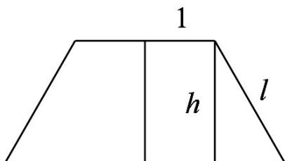

> [!faq]- 《专题03_圆柱_圆锥_圆台及球表面积与体积的五大常考题型_高效培优专项》官方解析
>
> > [!success]- **【答案】** C
>
> > [!note]- **【分析】**
> > 根据圆台的侧面积公式求出母线长 $l$ ，进而求出圆台高 $h$ ，再利用圆台的体积公式即可求解
>
> > [!note]- **【解析】**
> > 设圆台上、下底面圆的半径分别为 $r_1, r_2$ ，圆台上、下底面圆的面积分别为 $S_1, S_2$ ，圆台高为 $h$ ，母线长为 $l$ ，
> >
> > 因为圆台的上、下底面的面积分别为 $\pi$ ， $4\pi$
> >
> > 所以 $S_{1} = \pi r_{1}^{2} = \pi$ ， $S_{2} = \pi r_{2}^{2} = 4\pi$ ，解得 $r_1 = 1$ ， $r_2 = 2$
> >
> > 由题意得，圆台的侧面积为 $\pi(r_{1}+r_{2})l=3\pi l=6\pi$ ，所以 l=2，
> >
> > 作圆台的轴截面，如图：
> >
> > 2
> > 
> >
> > 所以圆台的高 $h = \sqrt{l^2 - (r_2 - r_1)^2} = \sqrt{3}$
> >
> > 所以圆台的体积 $V=\frac{1}{3}\left(S_{1}+\sqrt{S_{1}S_{2}}+S_{2}\right)h=\frac{1}{3}\left(\pi+\sqrt{\pi\times4\pi}+4\pi\right)\times\sqrt{3}=\frac{7\sqrt{3}\pi}{3}$
> >
> > 故选 **C**.
