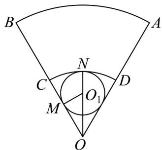

> [!faq]- 《专题03_圆柱_圆锥_圆台及球表面积与体积的五大常考题型_高效培优专项》官方解析
>
> > [!success]- **【答案】** (1)18 (2) $198\pi$
>
> > [!note]- **【分析】**
> > （1）根据AB的长度等于 $\odot O_{1}$ 的周长可计算出 $\odot O_{1}$ 的半径，再根据几何关系可计算出OC的长度；
> >
> > (2) 根据条件先计算出上下底面的半径和母线长度，然后计算出下底面面积和侧面积，则结果可知.
>
> > [!note]- **【解析】**
> > （1）连接 $OO_{1}$ 并延长交 $D$ 于点N，过点 $O_{1}$ 作 $O_{1}M\perp OC$ 交OC于点M，
> >
> > 因为 $\angle AOB = \frac{\pi}{3}$ ，所以 $\square_{AB}$ 的长度为 $36 \cdot \frac{\pi}{3} = 12\pi$ ，所以 $\odot O_1$ 的周长为 $12\pi$ ，
> >
> > 所以 $2\pi \cdot O_{1}M = 12\pi$ ，所以 $O_{1}M = 6$
> >
> > 在 $\mathrm{Rt}^{\triangle}O_{1}MO$ 中， $\angle O_1OM = \frac{\pi}{6}$ ，所以 $OO_{1} = 2O_{1}M = 12$
> >
> > 所以 $OC = OO_{1} + O_{1}N = OO_{1} + O_{1}M = 18$
> >
> > 所以 OC 应取 18 厘米.
> >
> > 
> >
> > (2) 设圆台上、下底面的半径分别为 $r_{1}, r_{2}$ ，母线长为 l，
> >
> > 因为 $OC = 18$ ，所以 $\mathbb{E}D$ 的长度为 $18\cdot \frac{\pi}{3} = 6\pi$ ，所以 $2\pi r_{1} = 6\pi$ ，所以 $r_1 = 3$
> >
> > 因为 $O_{1}M = 6$ ，所以 $r_{2} = 6$
> >
> > 因为 OC = 18 ，所以 l = OB - OA = 36 - 18 = 18所以需要的铁皮为： $\pi r_{2}^{2}+\pi\left(r_{1}+r_{2}\right)l=36\pi+162\pi=198\pi$ 平方厘米，故需要 $198\pi$ 平方厘米的铁皮.
