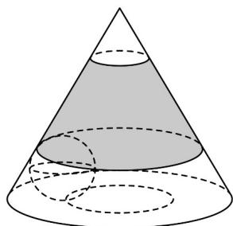
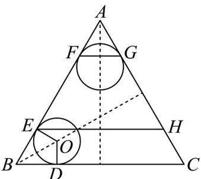

> [!faq]- 《专题03_圆柱_圆锥_圆台及球表面积与体积的五大常考题型_高效培优专项》官方解析
>
> > [!success]- **【答案】** D
>
> > [!note]- **【分析】**
> > 首先求圆台的母线，再代入圆台的表面积公式，即可求解.
>
> > [!note]- **【解析】**
> > 圆台的上底面的半径为 $r$ ，下底面的半径为 $R$ ，高为 $h$ ，母线长为 $l$ ， $l = \sqrt{(R - r)^2 + h^2} = 10$ ，
> > 所以圆台的表面积 $s = \pi (r + R)l + \pi r^2 +\pi R^2 = \pi (2 + 10)\times 10 + 4\pi +100\pi = 224\pi .$ 故选：D
> >
> > 27. 一封闭圆锥容器的轴截面是边长为 $4$ 的等边三角形，一个半径为 $\frac{\sqrt{3}}{3}$ 的小球在该容器内自由运动，如图所示，在圆锥内壁侧面，小球接触到的区域围成一个圆台侧面，在圆锥底面，小球接触到的区域是一个圆，则小球能接触到的圆锥容器内壁的最大面积为（）
> >
> > 【答案】
> >
> > 
> >
> > A. $\frac{7}{4}\pi$ B. $5\pi$ C. $\frac{9}{4}\pi$ D. $6\pi$
> >
> > 【答案】B
> >
> > 【分析】根据题意分析球体在运动过程中所能接触到内壁的构成，再应用相应的面积公式求小球能接触到的圆锥容器内壁的最大面积.
> > 【详解】由题意，轴截面示意图如下，当球与圆锥轴截面两条边都相切时，球心O在角平分线上，
> >
> > 
> >
> > 由 $OD = \frac{\sqrt{3}}{3}$ ， $\angle OBD = 30^{\circ}$ ，则 $\tan 30^{\circ} = \frac{OD}{BD} = \frac{\sqrt{3}}{3}$ ，可得 BD = 1，
> > 所以小球接触到底面是直径为 BC - 2BD = 4 - 2 × 1 = 2 的圆，
> > 如上图 E, F, G, H 都是球与圆锥内壁的切点，且 FG // EH // BC，
> > 而 $EF = AB - 2BE = 2$ ，且 $\frac{AE}{AB} = \frac{EH}{BC} \Rightarrow EH = 3$ ， $\frac{AF}{AB} = \frac{FG}{BC} \Rightarrow FG = 1$ ，
> > 所以小球接触到侧面是上底面直径为1，下底面直径为3，母线长为2的圆台侧面，
> > 所以小球能接触到的圆锥容器内壁的最大面积为 $\pi \times 1^{2} + \frac{1}{2} \times \pi \times (1 + 3) \times 2 = 5\pi$
> >
> > 故选：B
> >
> > 28. 圆台的一个底面周长是另一个底面周长的 3 倍，母线长为 7，圆台的侧面积为 $84\pi$ ，则圆台较小底面的半径为（） A.8 B.7 C.5 D.3
> >
> > 【答案】D
> >
> > 【分析】根据给定条件，利用圆台侧面积公式列式求解.
> > 【详解】设圆台较小底面的半径为 r ，
> >
> > 由圆台的一个底面周长是另一个底面周长的 3 倍，得该圆台较大底面的半径为 $3r$ ，由母线长为 7，圆台的侧面积为 $84\pi$ ，得 $\pi(r + 3r) \cdot 7 = 84\pi$ ，解得 $r = 3$ ，经验证符合题意，所以圆台较小底面的半径为 3.
> >
> > 故选 **D**
