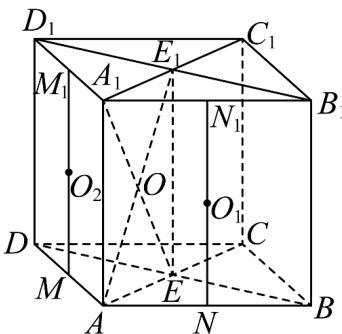

> [!faq]- 《专题03_圆柱_圆锥_圆台及球表面积与体积的五大常考题型_高效培优专项》官方解析
>
> > [!success]- **【答案】** $\sqrt{11}\pi$
>
> > [!note]- **【分析】**
> > 先由题意分析得到球心 $O_{1}$ ， $O_{2}$ 的具体位置，再分析得到轨迹 $\Gamma$ 即为以 $O$ 为圆心，且过 $A_{1}, A, E, E_{1}$ 四点的圆的周长，然后在矩形 $A_{1}AE_{1}E$ 中，求出外接圆直径 $2r = AE_{1}$ ，即可求出 $\Gamma$ 的周长.
>
> > [!note]- **【解析】**
> > 
> >
> > 如图所示，设 $E_{1}$ 为 $B_{1}D_{1}$ 的中点， $M_{1}, N_{1}$ 分别为 $A_{1}D_{1}, A_{1}B_{1}$ 的中点，
> >
> > $M, N$ 分别为 $AD, AB$ 的中点，连接 $M_{1}M, N_{1}N, A_{1}E, AE_{1}$
> >
> > $O_{1}, O_{2}$ 分别为 $M_{1} M, N_{1} N$ 的中点， $A_{1} E \cap A E_{1} = O$
> >
> > 由题意可知，因为 $A_{1}, A, B, E$ 四点都在球 $O_{1}$ 的球面上，
> >
> > 所以 $O_{1}$ 即为三棱锥 $A_{1}-ABE$ 外接球的球心，
> >
> > 也就是三棱柱 $A_{1}B_{1}E_{1}-ABE$ 外接球的球心，
> >
> > 因为三棱柱 $A_{1}B_{1}E_{1}-ABE$ 是直三棱柱，且 $\triangle ABE$ 为直角三角形，
> >
> > 所以外接球的球心 $O_{1}$ 在 $N_{1}N$ 的中点处，
> >
> > 同理， $O_{2}$ 就是三棱柱 $A_{1}D_{1}E_{1} - ADE$ 外接球的球心，且 $O_{2}$ 在 $M_1M$ 的中点处，
> >
> > 因为球 $O_{1}$ 与球 $O_{2}$ 两球面同时经过 $A_{1}, A, E, E_{1}$ 四点，
> >
> > 所以球 $O_{1}$ 与球 $O_{2}$ 两球面上的所有公共点构成轨迹 $\Gamma$
> >
> > 即为以 O 为圆心，且过 $A_{1}, A, E, E_{1}$ 四点的圆的周长，
> >
> > 在矩形 $A_{1}AE_{1}E$ 中，因为 AB=2 ，AD=2 ， $A_{1}A=3$
> >
> > 所以 $AC = 2\sqrt{2}$ ， $AE = \frac{1}{2} AC = \sqrt{2}$
> >
> > 所以矩形 $A_{1}AE_{1}E$ 的外接圆直径 $2r = AE_{1} = \sqrt{AE^{2} + AA_{1}^{2}} = \sqrt{2 + 9} = \sqrt{11}$ 所以 $r = \frac{\sqrt{11}}{2}$ ，所以外接圆的周长为 $2\pi r = \sqrt{11}\pi$ 故答案为： $\sqrt{11}\pi$
