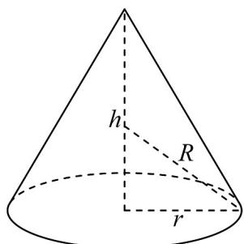

> [!faq]- 《专题03_圆柱_圆锥_圆台及球表面积与体积的五大常考题型_高效培优专项》官方解析
>
> > [!success]- **【答案】** A. $\frac{25\pi}{16}$ B. $\frac{25\pi}{8}$ C. $\frac{25\pi}{4}$ D. $\frac{125\pi}{48}$
>
> > [!note]- **【分析】**
> > 根据给定条件，可得当该球为圆锥的外接球时，球的表面积最小，设球的半径为 $R$ ，再根据勾股定理求出球的半径可得答案.
>
> > [!note]- **【解析】**
> > 由题意知，当该球为圆锥的外接球时，球的表面积最小，
> > 圆锥的底面半径为 $r = 1$ ，体积为 $V = \frac{1}{3} h\cdot \pi r^2 = \frac{\pi}{3} h\cdot 1^2 = \frac{2\pi}{3}$ 高 $h = 2$ ，
> > 设球的半径为 $R$ ，由图可得 $R^2 = (2 - R)^2 +1^2$ ，解得 $R = \frac{5}{4}$ ，
> > 故球的表面积的最小值为 $S = 4\pi R^2 = \frac{25\pi}{4}$ ：
> >
> > 故选：C
> >
> > 
