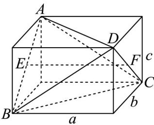

> [!faq]- 《专题03_圆柱_圆锥_圆台及球表面积与体积的五大常考题型_高效培优专项》官方解析
>
> > [!success]- **【答案】** $2\pi$
>
> > [!note]- **【分析】**
> > 依题意可构造长方体使得四面体 $ABCD$ 的顶点与长方体的顶点重合，长方体的外接球即为四面体 $ABCD$ 的外接球，求出长方体外接球的半径，即可求出外接球的表面积.【详解】由题可将几何体补形为长方体，如下图所示：
>
> > [!note]- **【解析】**
> > 对棱 $AB = CD = 1$ ，且对棱中点 $E, F$ 分别满足 $EF \perp AB, EF \perp CD$ 所以该长方体的外接球即为四面体 $ABCD$ 的外接球，
> > 
> > 设长方体的长、宽、高分别为 $a, b, c$
> > 则 $b^{2} + c^{2} = AB^{2} = 1, a = EF = 1$
> > 所以外接球的半径 $R = \frac{\sqrt{a^2 + b^2 + c^2}}{2} = \frac{\sqrt{2}}{2}$ ，即四面体 $ABCD$ 的外接球半径为 $\frac{\sqrt{2}}{2}$
> > 因此，该四面体外接球的表面积 $S = 4\pi R^2 = 4\pi \times \left(\frac{\sqrt{2}}{2}\right)^2 = 2\pi$
> > 故答案为： $2\pi$
