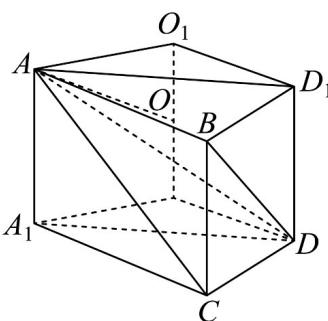

> [!faq]- 《专题03_圆柱_圆锥_圆台及球表面积与体积的五大常考题型_高效培优专项》官方解析
>
> > [!success]- **【答案】** A. $16\pi$ B. $20\pi$ C. $24\pi$ D. $28\pi$
>
> > [!note]- **【分析】**
> > 将四面体ABCD补成如图所示的直三棱柱，利用直三棱柱的性质，结合球的表面积公式进行求解即可.
>
> > [!note]- **【解析】**
> > 将四面体 ABCD 补成如图所示的直三棱柱 $ABD_{1}-A_{1}CD$
> >
> > 
> >
> > 可知 $\angle A_{1}AD = 60^{\circ}$ ， $A_{1}A = 2$ ，故 $A_{1}D = AD_{1} = 2\sqrt{3}$
> >
> > 又 $AB = BD_{1} = 2$ ，所以 $\angle ABD_{1} = 120^{\circ}$
> >
> > 设四面体 ABCD 的外接球球心为 O，
> >
> > 则 O 在平面 $ABD_{1}$ 内的射影 $O_{1}$ 为 $\triangle ABD_{1}$ 的外心，且 $OO_{1}=1$
> >
> > 由正弦定理得 $O_{1}A=\frac{1}{2}\times\frac{AD_{1}}{\sin\angle ABD_{1}}=\frac{1}{2}\times\frac{2\sqrt{3}}{\frac{\sqrt{3}}{2}}=2$
> >
> > 故外接球半径 $R = OA = \sqrt{O_1O^2 + O_1A} = \sqrt{1 + 4} = \sqrt{5}$ ，故 $S = 4\pi R^2 = 20\pi$
> >
> > 故选 **B**
