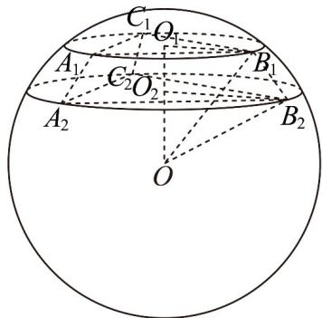
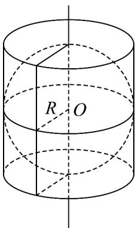

> [!faq]- 《专题03_圆柱_圆锥_圆台及球表面积与体积的五大常考题型_高效培优专项》官方解析
>
> > [!success]- **【答案】** A. $\frac{265}{2}\pi$ B. $\frac{265}{4}\pi$ C. $\frac{1060}{7}\pi$ D. $\frac{5090}{9}\pi$
>
> > [!note]- **【分析】**
> > 根据题意可求出正三棱台上下底面所在圆面的半径 $r_1, r_2$ ，再根据球心距，圆面半径，以及球的半径之间的关系，即可解出球的半径，从而得出球的表面积。
>
> > [!note]- **【解析】**
> > 设正三棱台上下底面所在圆面的半径 $r_{1}, r_{2}$ ，所以 $2r_{1} = \frac{3\sqrt{3}}{\sin60^{\circ}}, 2r_{2} = \frac{4\sqrt{3}}{\sin60^{\circ}}$
> >
> > $$
> > r _ {1} = 3, r _ {2} = 4
> > $$
> >
> > $$
> > d _ {1}, d _ {2}
> > $$
> >
> > 所以 $d_{1} = \sqrt{R^{2} - 9}$ ， $d_{2} = \sqrt{R^{2} - 16}$ ，故 $\left|d_1 - d_2\right| = 2$ 或 $d_{1} + d_{2} = 2$
> >
> > $\left|d_{1} - d_{2}\right| = 2$ 即 $\left|\sqrt{R^2 - 9} -\sqrt{R^2 - 16}\right| = 2$
> >
> > 又 $\sqrt{R^2 - 9} >\sqrt{R^2 - 16}$ ，即 $\sqrt{R^2 - 9} -\sqrt{R^2 - 16} = 2$
> >
> > 即 $\sqrt{R^2 - 9} = 2 + \sqrt{R^2 - 16}$
> >
> > 平方可得： $\sqrt{R^2 - 16} = \frac{3}{4}$ ，解得 $R^2 = \frac{265}{16}$
> >
> > 
> >
> > 即，即
> >
> > $$
> > d _ {1} + d _ {2} = 2
> > $$
> >
> > $$
> > \sqrt {R ^ {2} - 9} + \sqrt {R ^ {2} - 1 6} = 2
> > $$
> >
> > $$
> > \sqrt {R ^ {2} - 9} = 2 - \sqrt {R ^ {2} - 1 6}
> > $$
> >
> > 平方得 $\sqrt{R^{2}-16}=-\frac{3}{4}$ ，无解，
> >
> > 所以球的表面积为 $S = 4\pi R^2 = \frac{265}{4}\pi$
> >
> > 故选：B.
> >
> > 46．“圆柱容球”是阿基米德最欣赏的几何体．如图，圆柱的底面直径和高都等于球的直径，球与圆柱的体积之比为 $\lambda$ ，表面积之比为 $\mu$ ，则（）
> >
> > 【答案】
> >
> > 
> >
> > A. $\lambda = \frac{2}{3}$ , $\mu = 1$ B. $\lambda = \mu = \frac{2}{3}$ C. $\lambda = \frac{1}{2}$ , $\mu = \frac{2}{3}$ D. $\lambda = \mu = \frac{1}{2}$
> >
> > 【答案】B
> >
> > 【分析】设球的半径为 $R$ ，分别求出球的体积与圆柱体积，以及球的表面积与圆柱的表面积，即可得解.
> >
> > 【详解】设球的半径为 $R$ ，则球的体积为 $V_{1} = \frac{4}{3}\pi R^{3}$ ，圆柱的体积为 $V_{2} = \pi R^{2}\times 2R = 2\pi R^{3}$
> >
> > 球的表面积为 $S_{1} = 4\pi R^{2}$ ，圆柱的表面积为 $S_{2} = 2\pi R\times 2R + 2\pi R^{2} = 6\pi R^{2}$
> >
> > 所以 $\lambda = \frac{V_1}{V_2} = \frac{2}{3}$ ， $\mu = \frac{S_1}{S_2} = \frac{2}{3}$ ，所以 $\lambda = \mu = \frac{2}{3}$
> >
> > 故选 **B**.
