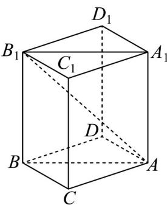

> [!faq]- 《专题03_圆柱_圆锥_圆台及球表面积与体积的五大常考题型_高效培优专项》官方解析
>
> > [!success]- **【答案】** $41\pi$
>
> > [!note]- **【分析】**
> > 利用补形法，把底面是直角三角形的直三棱柱补形为长方体，再利用长方体的外接球直径是长方体的对角线，即可求解外接球的表面积.
>
> > [!note]- **【解析】**
> > 
> >
> > 在直三棱柱 $ABC - A_{1}B_{1}C_{1}$ 中，因为 $AB = 5, BC = 3, AC = 4$
> >
> > $AB^{2} = BC^{2} + AC^{2}$ 可得 $BC \perp AC$
> >
> > 则可把这个直三棱柱 $ABC - A_{1}B_{1}C_{1}$ 补形为长方体 $BCAD - B_{1}C_{1}A_{1}D_{1}$
> >
> > 所以长方体 $BCAD - B_{1}C_{1}A_{1}D_{1}$ 的外接球就是直三棱柱 $ABC - A_{1}B_{1}C_{1}$ 的外接球，
> >
> > 即该球的直径为长方体 $BCAD - B_{1}C_{1}A_{1}D_{1}$ 的体对角线 $AB_{1}$
> >
> > 又 $AA_{1} = 4$ ，则 $AB_{1} = \sqrt{AC^{2} + BC^{2} + A_{1}A^{2}} = \sqrt{9 + 16 + 16} = \sqrt{41}$
> >
> > 则三棱柱 $ABC - A_{1}B_{1}C_{1}$ 的外接球表面积为 $S = 4\pi \left(\frac{AB_{1}}{2}\right)^{2} = 4\pi \left(\frac{\sqrt{41}}{2}\right)^{2} = 41\pi$
> >
> > 故答案为： $41\pi$
