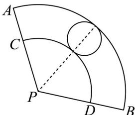
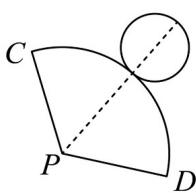
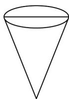
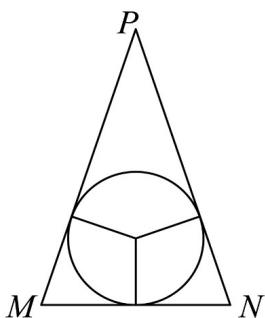

> [!faq]- 《专题03_圆柱_圆锥_圆台及球表面积与体积的五大常考题型_高效培优专项》官方解析
>
> > [!success]- **【答案】**  图1  图2  图3 A. $2^{\frac{1}{2}}$ B. $2^{\frac{1}{3}}$ C. $2^{\frac{1}{6}}$ D. $2^{\frac{7}{6}}$
>
> > [!note]- **【分析】**
> > 先求出圆锥的母线、底面半径和高，再由轴截面内切圆求出内切球半径，分别求出体积，根据体积比与高之比的关系即可得解.
>
> > [!note]- **【解析】**
> > 由题意， $\frac{2}{3}\pi PC=\pi(5-PC)$ ，则PC=3，
> >
> > 则圆锥母线 $l = 3$ ，底面半径 $r = 1$ ，高 $h = \sqrt{l^2 - r^2} = 2\sqrt{2}$
> >
> > 圆锥内能放入的最大球即为圆锥的内切球，设其半径为 $R$ ，轴截面如图所示，
> >
> > $S_{\triangle PMN} = \frac{1}{2}\times 2rh = \frac{1}{2}\bigl (PM + PN + MN\bigr)R$ ，得 $R = \frac{\sqrt{2}}{2}$
> >
> > 则 $V_{\text{球}} = \frac{4}{3}\pi R^3 = \frac{\sqrt{2}}{3}\pi$ ，而 $V_{\text{锥}} = \frac{1}{3}\pi r^2 h = \frac{2\sqrt{2}}{3}\pi$
> >
> > 设水面高度为 $H$ ，则 $\frac{V_{\text{球}}}{V_{\text{锥}}} = \left(\frac{H}{h}\right)^3 = \left(\frac{H}{2\sqrt{2}}\right)^3 = \frac{1}{2}$ ，得 $H = 2^{\frac{7}{6}}$
> >
> > 
> >
> > 故选 **D**.
