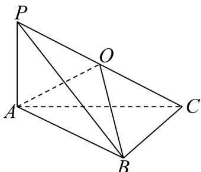

> [!faq]- 《专题03_圆柱_圆锥_圆台及球表面积与体积的五大常考题型_高效培优专项》官方解析
>
> > [!success]- **【答案】** $\frac{\sqrt{3}}{2}\pi/\frac{\sqrt{3}\pi}{2}$
>
> > [!note]- **【分析】**
> > 取 $PC$ 的中点 $O$ ，连接 $AO, BO$ ，证得 $BC \perp$ 平面 $PAB$ ，得到 $BC \perp PB$ ，利用直角三角形的性质，得到 $OA = OB = OC = OP$ ，即 $O$ 为三棱锥 $P - ABC$ 的外接球的球心，设三棱锥 $P - ABC$ 的外接球的半径为 $R$ ，得到 $R = \frac{1}{2} PC$ ，结合球的体积公式，即可求解。
>
> > [!note]- **【解析】**
> > 如图所示，取PC的中点O，分别连接AO,BO，
> >
> > 因为 $PA \perp$ 平面 $ABC$ ， $BC \subset$ 平面 $ABC$ ，所以 $PA \perp BC$ ，
> >
> > 又因为 VABC 是以 AC 为斜边的等腰直角三角形，所以 $AB \perp BC$
> >
> > 因为 $AB \cap PA = A$ ，且 $AB, PA \subset$ 平面 PAB，所以 $BC \perp$ 平面 PAB，
> >
> > 又因为 $PB \subset$ 平面 $PAB$ ，所以 $BC \perp PB$
> >
> > 在直角 $\triangle PAC$ 中，可得 $AO = \frac{1}{2} PC$ ，在直角 $\triangle PBC$ 中，可得 $BO = \frac{1}{2} PC$ 所以 $OA = OB = OC = OP$ ，即 $O$ 为三棱锥 $P - ABC$ 的外接球的球心，在直角 $\triangle PAC$ 中， $PA = 1, AC = \sqrt{2}$ ，可得 $PC = \sqrt{PA^2 + AC^2} = \sqrt{3}$ 设三棱锥 $P - ABC$ 的外接球的半径为 $R$ ，则 $R = \frac{1}{2} PC = \frac{\sqrt{3}}{2}$ 所以三棱锥 $P - ABC$ 的外接球体积为 $V = \frac{4}{3}\pi \times (\frac{\sqrt{3}}{2})^3 = \frac{\sqrt{3}}{2}\pi.$ 故答案为： $\frac{\sqrt{3}}{2}\pi$
> >
> > 
