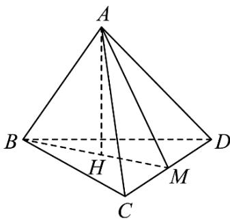

> [!faq]- 《专题03_圆柱_圆锥_圆台及球表面积与体积的五大常考题型_高效培优专项》官方解析
>
> > [!success]- **【答案】** A. $3\sqrt{3}$ B. $4\sqrt{3}$ C. $6\sqrt{3}$ D. $8\sqrt{3}$
>
> > [!note]- **【分析】**
> > 设正四面体 ABCD 的棱长为 a，求出正四面体的表面积 S 和体积 V，利用 $V = \frac{1}{3} Sr$ 求得 $r = \frac{\sqrt{6} a}{12}$ ，再根据题目信息求出 a，即可求出答案.
>
> > [!note]- **【解析】**
> > 设正四面体 $ABCD$ 的棱长为 $a$ ，正四面体表面积等于其四个面的面积之和，且每一个面都是正三角形，
> >
> > 所以正四面体 ABCD 的表面积 $S = 4 \times \frac{1}{2} \times a \times \frac{\sqrt{3}}{2} a = \sqrt{3} a^{2}$
> >
> > 如图，M 为 CD 中点，设 A 在底面 BCD 的投影为 H，H 为 $\triangle BCD$ 的中心，
> >
> > 
> >
> > 则 $BM = \frac{\sqrt{3}a}{2}$ ， $BH = \frac{2}{3} BM = \frac{\sqrt{3}a}{3}$ ， $AH = \sqrt{AB^2 - BH^2} = \frac{\sqrt{6}}{3} a$
> >
> > 四面体 ABCD 的体积为 $V = \frac{1}{3} S_{\triangle BCD} \cdot AH = \frac{1}{3} \cdot \frac{\sqrt{3}}{4} a^{2} \cdot \frac{\sqrt{6} a}{3} = \frac{\sqrt{2} a^{3}}{12}$ ，
> >
> > 则有 $V = \frac{1}{3} Sr$ ，即 $\frac{\sqrt{2}a^3}{12} = \frac{\sqrt{3}a^2}{3} r$ ，解可得 $r = \frac{\sqrt{6}a}{12}$
> >
> > 因为正四面体的内切球体积为 $\pi$ ，
> >
> > 所以 $\frac{4}{3}\pi r^3 = \pi$ ，即 $r^3 = \frac{3}{4}$
> >
> > 则 $a^3 = \left(\frac{12}{\sqrt{6}} r\right)^3 = 48\sqrt{6} \times \frac{3}{4} = 36\sqrt{6}$
> >
> > 则正四面体的体积 $V=\frac{\sqrt{2}a^{3}}{12}=6\sqrt{3}$ .
> >
> > 故选 **C**.
