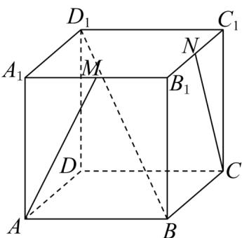

<!-- question-source:start -->
5．如图，在正方体 $ABCD-A_{1}B_{1}C_{1}D_{1}$ 中，点 M、N 分别是 $A_{1}B_{1}$ 、 $B_{1}C_{1}$ 的中点．求证：

(1)直线 $AM$ 和 $CN$ 在同一平面上；

(2)直线 AM 、 $BB_{1}$ 和 CN 交于一点.
<!-- question-source:end -->

![[高中/课堂同步/题库/人教A版高中数学同步讲义(2026)/02_必修第二册/第八章 立体几何初步/专项训练/专题04_空间中点线面关系的五大常考题型_高效培优专项训练_/题型一_sec_02/questions/answers/Q00065067A1.md]]
