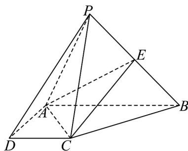

<!-- question-source:start -->
6．如图，在四棱锥 P-ABCD 中， $PC \perp$ 底面 ABCD，ABCD 是直角梯形， $AD \perp DC$ ， $AB // DC$ ，
AB = 2AD = 2CD = 2，点E是PB的中点.

(1)线段 $PA$ 上是否存在一点 $G$ ，使得点 $D$ ， $C$ ， $E$ ， $G$ 共面？若存在，请证明，若不存在，请说明理由；

(2)若 $PC = 2$ ，求三棱锥 $P - ACE$ 的体积.
<!-- question-source:end -->

![[高中/课堂同步/题库/人教A版高中数学同步讲义(2026)/02_必修第二册/第八章 立体几何初步/专项训练/专题04_空间中点线面关系的五大常考题型_高效培优专项训练_/题型一_sec_02/questions/answers/Q00065068A1.md]]
