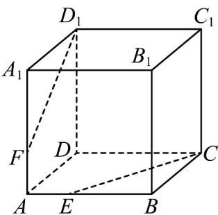

<!-- question-source:start -->
18．如图，在正方体 $ABCD - A_{1}B_{1}C_{1}D_{1}$ 中， $E$ ， $F$ 分别是 $AB, AA_{1}$ 上的点，且 $A_{1}F = 2FA, BE = 2AE$

(1)证明： $E,C,D_{1},F$ 四点共面；

(2)设 $D_{1}F \cap CE = O$ ，证明： $A, O, D$ 三点共线.
<!-- question-source:end -->

![[高中/课堂同步/题库/人教A版高中数学同步讲义(2026)/02_必修第二册/第八章 立体几何初步/专项训练/专题04_空间中点线面关系的五大常考题型_高效培优专项训练_/题型一_sec_02/questions/answers/Q00065079A1.md]]
