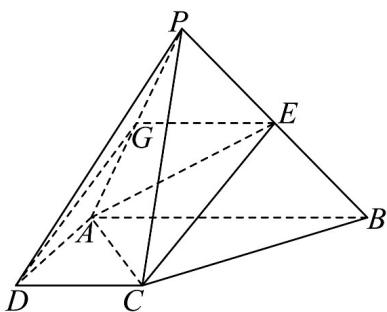

> [!faq]- 《专题04_空间中点线面关系的五大常考题型_高效培优专项训练_》官方解析
>
> > [!success]- **【答案】** (1)存在，证明见解析 (2) $\frac{1}{3}$
>
> > [!note]- **【分析】**
> > （1）利用中位线定理与平行线的传递性即可得证；
> >
> > (2) 利用棱锥的体积公式，结合中点的性质转化求解即可.
>
> > [!note]- **【解析】**
> > （1）存在，当 $G$ 为 $PA$ 的中点时满足条件，证明如下：
> >
> > 如图，连接 GE，GD，则 GE 是三角形 PAB 的中位线，
> >
> > 
> >
> > 所以 $GE \parallel AB$ ，又由已知 $AB \parallel DC$
> >
> > 所以 $GE \parallel DC$ ，所以 $G$ ， $E$ ， $C$ ， $D$ 四点共面。
> >
> > (2) 因为 $E$ 是 $PB$ 的中点，所以 $V_{P-ACE} = V_{C-PAE} = \frac{1}{2} V_{P-ACB} = \frac{1}{2} V_{C-PAB}$ ，
> >
> > 因为 $AD \perp DC, AB //DC$ ，所以 $AC = \sqrt{2}, CB = \sqrt{2}$
> >
> > 故 $AC^2 + BC^2 = AB^2$ ，所以 $AC \perp BC$
> >
> > 所以 $S_{\triangle ABC} = \frac{1}{2} AC \cdot BC = \frac{1}{2} \times \sqrt{2} \times \sqrt{2} = 1$ ，则 $V_{P - CAB} = \frac{1}{3} PC \cdot S_{\triangle CAB} = \frac{2}{3}$
> >
> > $$
> > \therefore V _ {P - A C E} = \frac {1}{2} V _ {P - C A B} = \frac {1}{3}.
> > $$
