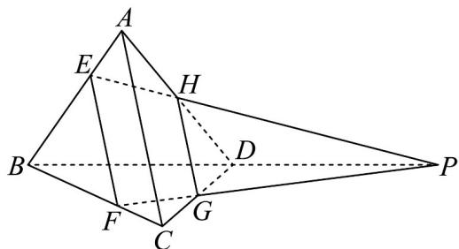

> [!faq]- 《专题04_空间中点线面关系的五大常考题型_高效培优专项训练_》官方解析
>
> > [!success]- **【答案】** (1)证明见解析 (2)证明见解析
>
> > [!note]- **【分析】**
> > （1）作出辅助线，由中位线得到平行关系及比例关系，进而得到 $EF \parallel AC$ ，且 $HG \neq EF$ ，故四边形为梯形；
> >
> > (2) 由 (1) 得到 $EH, FG$ 相交于一点 $P$ ，因为 $P \in$ 平面 $ABD$ ， $P \in$ 平面 $BCD$ ，而平面 $ABD \cap$ 平面 $BCD = BD$ ，所以 $P \in BD$ ，证明出结论.
>
> > [!note]- **【解析】**
> > （1）由题意，作图如下：
> >
> > 
> >
> > 连接 $EF$ 、HG，因为空间四边形ABCD中，H，G分别是AD，CD的中点，
> >
> > 所以 $HG // AC$ ，且 $HG = \frac{1}{2} AC$
> >
> > 又因为 $\frac{CF}{FB} = \frac{AE}{EB} = \frac{1}{3}$ ，所以 $EF \parallel AC$ ，且 $EF = \frac{3}{4} AC$ ，
> >
> > 所以 $HG // AC$ ，且 $HG \neq EF$
> >
> > 故四边形 EFGH 为梯形.
> >
> > (2) 由 (1) 知四边形 $EFGH$ 为梯形，且 $EH, FG$ 是梯形的两腰，
> >
> > 所以 $EH, FG$ 相交于一点.
> >
> > 设交点为 P ，
> >
> > 因为 $EH \subset$ 平面ABD，所以 $P \in$ 平面ABD
> >
> > 同理 $P \in$ 平面 $BCD$ ，而平面 $ABD \cap$ 平面 $BCD = BD$ ，所以 $P \in BD$
> >
> > 故点 P 是直线 EH, BD, FG 的公共点，即直线 EH, BD, FG 相交于一点.
