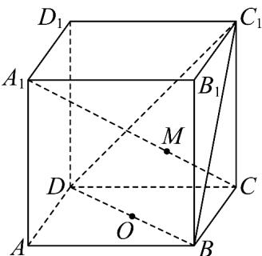
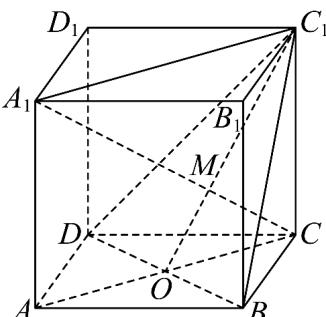

> [!faq]- 《专题04_空间中点线面关系的五大常考题型_高效培优专项训练_》官方解析
>
> > [!success]- **【答案】** 
>
> > [!note]- **【分析】**
> > 根据图示可得三点 $C_{1}$ ，M，O在平面 $C_{1}BD$ 与平面 $ACC_{1}A_{1}$ 的交线上，则可得答案.
>
> > [!note]- **【解析】**
> > $\because O \in BD, BD \subset \text{平面} C_{1}BD, \therefore O \in \text{平面} C_{1}BD$
> >
> > ∵O为BD中点，∴O为AC中点，
> >
> > $\therefore O \in AC, AC \subset \text{平面} ACC_{1}A_{1}, \therefore O \in \text{平面} ACC_{1}A_{1}$ .
> >
> > ∴ O 是平面 $ACC_{1}A_{1}$ 和平面 $C_{1}BD$ 的公共点；
> >
> > 同理可得，点 M 和 $C_{1}$ 都是平面 $ACC_{1}A_{1}$ 和平面 $C_{1}BD$ 的公共点，
> >
> > ∴三点 $C_{1}$ ，M，O 在平面 $C_{1}BD$ 与平面 $ACC_{1}A_{1}$ 的交线上，
> >
> > 即 $C_{1}$ ，M，O三点共线.
> >
> > 
