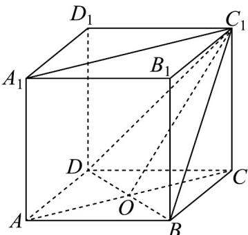

> [!faq]- 《专题04_空间中点线面关系的五大常考题型_高效培优专项训练_》官方解析
>
> > [!success]- **【答案】** (1)在同一平面内； (2)作图见解析
>
> > [!note]- **【分析】**
> > （1）经过两条平行直线，有且只有一个平面，由此判断 $AA_{1}$ 与 $CC_{1}$ 是在同一平面；
> >
> > (2) 先画出图象，再求出平面 $ACC_{1}A_{1}$ 与平面 $BC_{1}D$ 的公共点，由此画出两个平面的交线.
>
> > [!note]- **【解析】**
> > （1） $\because AA_{1} // CC_{1}$
> >
> > $\therefore AA_{1}$ 与 $CC_{1}$ 可确定平面 $ACC_{1}A_{1}$
> >
> > $\therefore AA_{1}$ 与 $CC_{1}$ 在同一平面内.
> >
> > (2) 如图所示:
> >
> > 
> >
> > 设 $AC \cap BD = O$ ，连接 $OC_{1}$ ，则 $O \in$ 平面 $ACC_{1}A_{1}$ ，且 $O \in$ 平面 $BC_{1}D$ 。
> >
> > $\because C_{1}\in$ 平面 $ACC_{1}A_{1}$ ，且 $C_{1}\in$ 平面 $BC_{1}D$ ，
> >
> > ∴平面 $ACC_{1}A_{1} \cap$ 平面 $BC_{1}D = OC_{1}$
