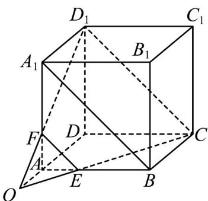
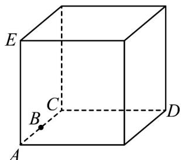
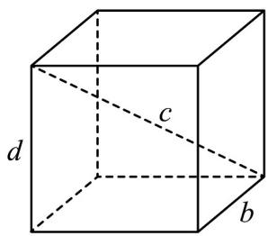

> [!faq]- 《专题04_空间中点线面关系的五大常考题型_高效培优专项训练_》官方解析
>
> > [!success]- **【答案】** (1)证明见祥解 (2)证明见祥解
>
> > [!note]- **【分析】**
> > （1）连接 $EF, A_1B, D_1C$ ，利用中位线定理得到 $EF \parallel A_1B$ ，再根据正方体的性质得到 $BC \parallel A_1D_1$ ，进而证明四边形 $BCD_1A_1$ 是平行四边形，从而得到 $EF \parallel D_1C$ ，由此可证 $E, C, D_1, F$ 四点共面；
> >
> > (2) 先证 $O \in$ 平面 $ADD_{1}A_{1}$ ，且 $O \in$ 平面 $ABCD$ ，又平面 $ADD_{1}A_{1} \cap$ 平面 $ABCD = AD$
> >
> > 所以 $O \hat{1} AD$ ，进而得到 A，O，D 三点共线.
>
> > [!note]- **【解析】**
> > （1）证明：如图，连接 $EF, A_{1}B, D_{1}C$
> >
> > 
> >
> > 在正方体 $ABCD - A_{1}B_{1}C_{1}D_{1}$ 中， $A_{1}F = 2FA, BE = 2AE$ ，所以 $EF \parallel A_{1}B$
> >
> > 又 $BC\parallel A_1D_1$ ，且 $BC = A_{1}D_{1}$
> >
> > 所以四边形 $BCD_{1}A_{1}$ 是平行四边形，所以 $A_{1}B\parallel D_{1}C$
> >
> > $\therefore EF \parallel D_{1}C$ ，所以 $E, C, D_{1}, F$ 四点共面；
> >
> > (2) 证明：由 $D_{1}F \cap CE = O$ ， $\therefore O \in D_{1}F$ ，又 $D_{1}F \subset$ 平面 $ADD_{1}A_{1}$ ， $\therefore O \in$ 平面 $ADD_{1}A_{1}$ ，同理 $O \in$ 平面 $ABCD$ ，又平面 $ADD_{1}A_{1} \cap$ 平面 $ABCD = AD$ ，
> >
> > $\therefore O\in AD$ ，即 A，O，D 三点共线.
> >
> > 19. 以下四个命题中，正确的命题是（）
> >
> > 【答案】
> > A．不共面的四点中，其中任意三点不共线
> > B．若点 A, B, C, D 共面，点 A, B, C, E 共面，则 A, B, C, D, E 共面
> > C．若 VABC 在平面 $\alpha$ 外，它的三条边所在的直线分别交 $\alpha$ 于 P, Q, R，则 P, Q, R 三点共线
> > D．依次首尾相接的四条线段必共面
> >
> > 【答案】AC
> >
> > 【分析】利用反证法证明选项A判断正确；举特例否定选项B；利用基本事实证明选项C判断正确；举特例否定选项D.
> >
> > 【详解】对于 A，用反证法证明：假设四个点中，有三个点共线，
> >
> > 第四个点不在这条直线上，则根据基本事实的推论：一条直线和直线外一点
> >
> > 确定一个平面，可知这四个点共面，与已知矛盾，故 A 正确；
> >
> > 对于 B，如图，A，B，C，D 共面，A，B，C，E 共面，
> >
> > 但 A, B, C, D, E 不共面，故 B 错误；
> >
> > 
> >
> > 对于 C，因为 $P \in \alpha$ ， $P \in$ 平面 ABC，所以 P 在平面 $\alpha$ 与平面 ABC 的交线上，
> >
> > 同理， $Q$ ， $R$ 也在两平面的交线上，故 $P$ ， $Q$ ， $R$ 三点共线，故C正确；
> >
> > 对于 D，如图，a, b, c, d 四条线段首尾相接，但 a, b, c, d 不共面，故 D 错误.
> >
> > 
> >
> > 故选 **AC**.
