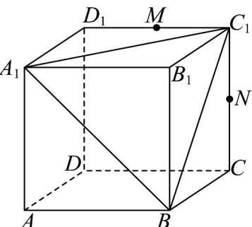

<!-- question-source:start -->
21．已知正方体 $ABCD-A_{1}B_{1}C_{1}D_{1}$ 中，AB=2，点 M，N 分别是线段 $C_{1}D_{1}$ ， $CC_{1}$ 的中点．

(1)求三棱锥 $M - A_{1}C_{1}B$ 的体积；

(2)求证：直线 $A_{1}M$ 、 $BN$ 、 $B_{1}C_{1}$ 三线共点.
<!-- question-source:end -->

![[高中/课堂同步/题库/人教A版高中数学同步讲义(2026)/02_必修第二册/第八章 立体几何初步/专项训练/专题04_空间中点线面关系的五大常考题型_高效培优专项训练_/题型三_sec_03/questions/answers/Q00065081A1.md]]
