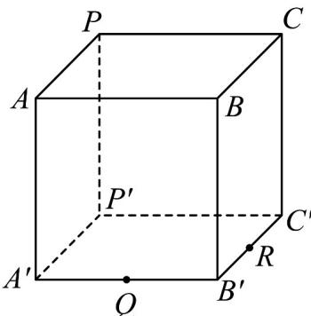

<!-- question-source:start -->
23. 如图，正四棱柱 $ABCP - A'B'C'P'$ .

(1)请在正四棱柱 $ABCP - A'B'C'P'$ 中，画出经过 $P$ 、 $Q$ 、 $R$ 三点的截面（无需证明）；

(2)若 $Q$ 、 $R$ 分别为 $A'B'$ 、 $B'C'$ 中点，证明： $AQ$ 、 $CR$ 、 $BB'$ 三线共点.
<!-- question-source:end -->

![[高中/课堂同步/题库/人教A版高中数学同步讲义(2026)/02_必修第二册/第八章 立体几何初步/专项训练/专题04_空间中点线面关系的五大常考题型_高效培优专项训练_/题型三_sec_03/questions/answers/Q00065083A1.md]]
