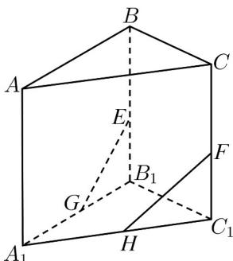

<!-- question-source:start -->
29. 如图，在三棱柱 $A_{1}B_{1}C_{1} - ABC$ 中， $E, F, G, H$ 分别为 $BB_{1}, CC_{1}, A_{1}B_{1}, A_{1}C_{1}$ 的中点。

(1)证明： $E$ ， $F$ ， $G$ ， $H$ 四点共面.

(2)证明： $EG$ ，FH， $AA_{1}$ 三线共点.
<!-- question-source:end -->

![[高中/课堂同步/题库/人教A版高中数学同步讲义(2026)/02_必修第二册/第八章 立体几何初步/专项训练/专题04_空间中点线面关系的五大常考题型_高效培优专项训练_/题型三_sec_03/questions/answers/Q00065089A1.md]]
