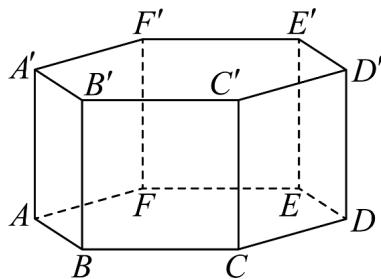

<!-- question-source:start -->
33. 如图为正六棱柱 $ABCDEF - A'B'C'D'E'F'$ . 其6个侧面的12条面对角线所在直线中，与直线 $A'B$ 异面的共有 \_\_\_\_ 条.

<!-- question-source:end -->

![[高中/课堂同步/题库/人教A版高中数学同步讲义(2026)/02_必修第二册/第八章 立体几何初步/专项训练/专题04_空间中点线面关系的五大常考题型_高效培优专项训练_/题型三_sec_03/questions/answers/Q00065093A1.md]]
