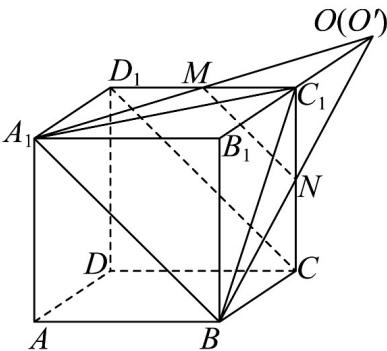

> [!faq]- 《专题04_空间中点线面关系的五大常考题型_高效培优专项训练_》官方解析
>
> > [!success]- **【答案】** (1) $\frac{2}{3}$ (2)证明见解析
>
> > [!note]- **【分析】**
> > （1）由等体积法结合棱锥的体积公式计算可得；（2）先证明直线 $A_{1}M, B_{1}C_{1}$ 相交，设交于 $O$ ，同理可得直线 $B_{1}C_{1}, BN$ 相交于点 $O'$ ，再由 $B_{1}C_{1} = OC_{1} = O'C_{1}$ 可得三线共点.
>
> > [!note]- **【解析】**
> > （1） $V_{M-A_{1}C_{1}B}=V_{B-A_{1}C_{1}M}=\frac{1}{3}\times\frac{1}{2}\times1\times2\times2=\frac{2}{3}$
> >
> > （2）由于 $A_{1}B_{1}\parallel MC_{1}$ 且 $A_{1}B_{1} = 2MC_{1}$ ，故直线 $A_{1}M, B_{1}C_{1}$ 相交，设交于 $O$ ，则 $B_{1}C_{1} = OC_{1}$ ，
> >
> > 同理可得直线 $B_{1}C_{1}, BN$ 相交于点 $O'$ ，则 $B_{1}C_{1} = O'C_{1}$ ，
> >
> > 故 $O'$ 与 $O$ 重合，故直线 $A_{1}M$ 、 $BN$ 、 $B_{1}C_{1}$ 三线相交于点 $O$
> >
> > 故直线 $A_{1}M$ 、BN、 $B_{1}C_{1}$ 三线交于一点。
> >
> > 
