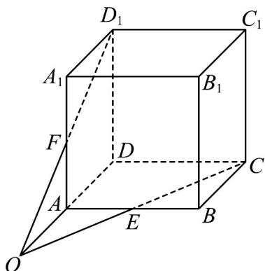

> [!faq]- 《专题04_空间中点线面关系的五大常考题型_高效培优专项训练_》官方解析
>
> > [!success]- **【答案】** 证明见解析
>
> > [!note]- **【分析】**
> > 根据 $E, F$ 分别是棱 $AB, AA_{1}$ 的中点可得 $\triangle A_{1}FD_{1} \cong \triangle AFO$ ，利用等角定理可得 $O, F, D_{1}$ 三点共线，同理可得 $O, E, C$ 三点共线；即三条直线 $DA, CE, D_{1}F$ 交于一点 $O$ 。
>
> > [!note]- **【解析】**
> > 延长 $CE$ 交 $DA$ 的延长线于点 $O$ ，如下图所示：
> >
> > 
> >
> > 易得 $OA = AD = A_{1}D_{1}$
> >
> > 在 $\triangle A_{1}FD_{1}$ 与VAFO中，
> >
> > $\left\{ \begin{array}{l} AF = A_{1}F \\ \angle FA_{1}D_{1} = \angle FAO = 90^{\circ} \\ OA = A_{1}D_{1} \end{array} \right.$ ，所以 $\triangle A_{1}FD_{1}\cong \triangle AFO$
> >
> > 所以 $\angle A_{1}FD_{1} = \angle AFO$ ，由等角定理可知 O, F, $D_{1}$ 三点共线；
> >
> > 同理可得 $O, E, C$ 三点共线；
> >
> > ∴三条直线 DA, CE, $D_{1}F$ 交于一点 O.
