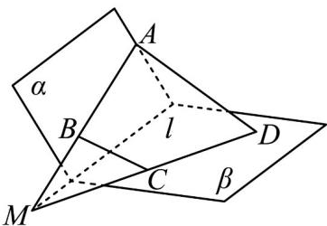

> [!faq]- 《专题04_空间中点线面关系的五大常考题型_高效培优专项训练_》官方解析
>
> > [!success]- **【答案】** 证明见解析
>
> > [!note]- **【分析】**
> > 设 AB 交 CD 于点 M，再根据若两个不重合的平面有一个公共点，那么它们有且只有一条过该点的公共直线，即可得证.
>
> > [!note]- **【解析】**
> > 如图，梯形ABCD中，因为AD//BC，
> >
> > 所以 AB 与 CD 必交于一点，
> >
> > 设 AB 交 CD 于点 M ，则 $M \in AB, M \in CD$
> >
> > 又因为 $AB \subset \alpha, CD \subset \beta$
> >
> > 所以 $M \in \alpha, M \in \beta$
> >
> > 又因为 $\alpha \cap \beta = l$ ，所以 $M \in l$ ，
> >
> > 所以 $AB, CD, l$ 共点.
> >
> > 
