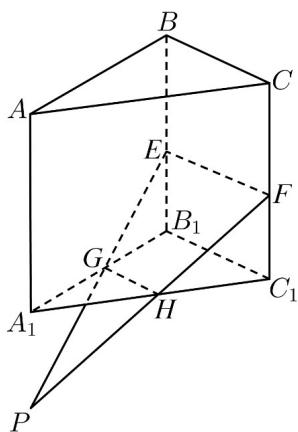

> [!faq]- 《专题04_空间中点线面关系的五大常考题型_高效培优专项训练_》官方解析
>
> > [!success]- **【答案】** (1)证明见解析 (2)证明见解析
>
> > [!note]- **【分析】**
> > (1)通过线线平行证明线线共线，从而达到四点共面；
> >
> > (2) 先延长 EG，FH 相交于点 P，再通过点线面的关系可证明结论.
>
> > [!note]- **【解析】**
> > （1）如图，连接 $EF$ ，GH
> >
> > ∵GH 是 $\triangle A_{1}B_{1}C_{1}$ 的中位线，∴ $GH \parallel B_{1}C_{1}$
> >
> > $\because B_{1}E \parallel C_{1}F$ ，且 $B_{1}E = C_{1}F$ ，∴四边形 $B_{1}EFC_{1}$ 是平行四边形，
> >
> > $\therefore EF \parallel B_{1}C_{1}, \therefore EF \parallel GH, \therefore E, F, G, H$ 四点共面.
> >
> > (2) 如图，延长 $EG$ ，FH 相交于点 $P$
> >
> > $\because P \in EG, EG \subset \text{平面} ABB_{1}A_{1}, \therefore P \in \text{平面} ABB_{1}A_{1}$
> >
> > $\because P \in FH, FH \subset \text{平面} ACC_{1}A_{1}, \therefore P \in \text{平面} ACC_{1}A_{1}$ .
> >
> > ∵平面 $ABB_{1}A_{1} \cap$ 平面 $ACC_{1}A_{1} = AA_{1}$
> >
> > $\therefore P \in AA_{1}, \therefore EG, FH, AA_{1}$ 三线共点.
> >
> > 
