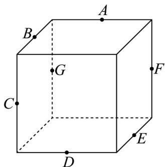
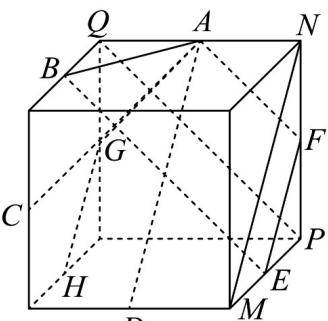

> [!faq]- 《专题04_空间中点线面关系的五大常考题型_高效培优专项训练_》官方解析
>
> > [!success]- **【答案】**  A. 直线 $AB$ B. 直线 $AC$ C. 直线 $AD$ D. 直线 $AG$
>
> > [!note]- **【分析】**
> > 本题考查正方体的结构特征，利用异面直线的判断法若 $a \subset \alpha, ABI \alpha = B, A \notin \alpha, B \notin a$ 则直线 $AB$ 与 $a$ 互为异面直线依次分析选项即可
>
> > [!note]- **【解析】**
> > 如图取中点 H，和顶点 M,N,P,Q 连接 EF,AB,AC,AD,AG,BE,AF,GH,MN,PQ
> >
> > 
> >
> > 在正方体中有 $AF // PQ, PQ // BE$ ，所以 $AF // BE$ ，所以点 $A, B, E, F$ 四点共面，所以直线 $EF$ 与直线 $AB$ 共面，
> >
> > 选项A不对；
> >
> > 由 A 选项可知点 A, B, E, F 四点共面，同理可知点 A, E, F, D 四点共面，点 F, E, D, C 四点共面，点 E, D, C, B 四点共面，所以 A, B, C, D, E, F 六点共面，所以直线 EF 与直线 AC 不是异面直线，选项 B 错误；
> >
> > 在正方体中有 $EF \parallel MN, MN \parallel AD$ ，所以 $EF \parallel AD$ ，选项 C 不对；
> >
> > 直线 $AG \subset$ 平面 AFG，直线 EFI 平面 $AFG = F, F \notin AG$ ，所以直线 AG 与直线 EF 是异面直线，选项 D 正确；
> >
> > 故选 **D**
