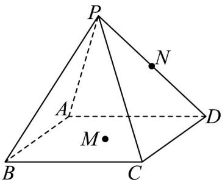
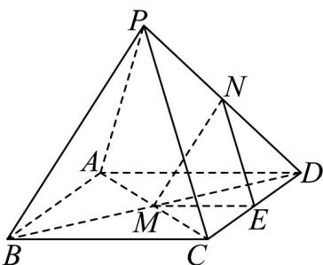

> [!faq]- 《专题04_空间中点线面关系的五大常考题型_高效培优专项训练_》官方解析
>
> > [!success]- **【答案】** 
>
> > [!note]- **【分析】**
> > 取 $CD$ 的中点 $E$ ，分别连接 $MN, NE, ME$ ，求得 $\triangle MNE$ 为等边三角形，得到 $\angle MNE = 60^{\circ}$ ，进而求得异面直线 $MN$ 与 $PC$ 所成角.
>
> > [!note]- **【解析】**
> > 如图所示，取 $CD$ 的中点 $E$ ，分别连接 $MN,NE,ME$
> >
> > 因为 M 为正方形 ABCD 中心，可得 ME = 2
> >
> > 又因为 $N, E$ 为 $PD, CD$ 的中点，可得 $NE // PC$ 且 $NE = \frac{1}{2} PC = 2$
> >
> > 因为 $M, N$ 为 $BD, PD$ 的中点，可得 $MN = \frac{1}{2} PB = 2$
> >
> > 所以 $\triangle MNE$ 为等边三角形，所以 $\angle MNE = 60^{\circ}$
> >
> > 又因为 $NE // PC$ ，所以异面直线 $MN$ 与 $PC$ 所成角，即为直线 $MN$ 与 $NE$ 所成角，
> >
> > 所以异面直线 $MN$ 与 $PC$ 所成角为 $60^{\circ}$
> >
> > 故答案为： $60^{\circ}$
> >
> > 
