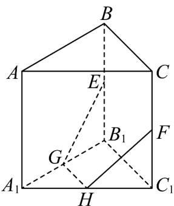
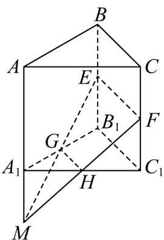

> [!faq]- 《专题04_空间中点线面关系的五大常考题型_高效培优专项训练_》官方解析
>
> > [!success]- **【答案】**  A. $E,F,G,H$ 四点共面 B. $AA_{1}$ 与 $GH$ 是异面直线 C. $\angle EGH = \angle FHG$ D. $EG, FH, AA_{1}$ 三线共点
>
> > [!note]- **【分析】**
> > 由中位线性质可判断选项A，由异面直线的特点可判断选项B，由梯形的性质可判断选项C，由平面基本性质可判断选项D.
>
> > [!note]- **【解析】**
> > 因为 E, F, G, H 分别为 $BB_{1}, CC_{1}, A_{1}B_{1}, A_{1}C_{1}$ 的中点，所以 $GH // B_{1}C_{1}$ ， $EF // B_{1}C_{1}$ ；
> >
> > 所以 $GH // EF$ ，所以 $E, F, G, H$ 四点共面，A 正确.
> >
> > 因为 $GH \mid$ 平面 $A_{1}B_{1}C_{1}$ ， $A_{1} \in$ 平面 $A_{1}B_{1}C_{1}$ 且 $A_{1} \notin GH$ ， $A \notin$ 平面 $A_{1}B_{1}C_{1}$ ，所以 $AA_{1}$ 与 GH 是异面直线，B 正确。
> > 由 $GH // EF$ ，且 $GH = \frac{1}{2} EF$ 可知，四边形 EFHG 是梯形，
> >
> > 若 $\angle EGH = \angle FHG$ ，则梯形 $EFHG$ 是等腰梯形，而题设条件无法得出 $EG = FH$
> >
> > 所以 C 不一定正确.
> >
> > 如图：
> >
> > 
> >
> > 设 $EG \cap FH = M$ ，则 $M \in EG$ ，又 $EG \subset$ 平面 $ABB_{1}A_{1}$ ，所以 $M \in$ 平面 $ABB_{1}A_{1}$ ；
> >
> > 同理可得 $M \in$ 平面 $ACC_{1}A_{1}$ ，即 $M$ 一定在平面 $ABB_{1}A_{1}$ 与平面 $ACC_{1}A_{1}$ 的交线上，
> >
> > 因为平面 $ABB_{1}A_{1}\cap$ 平面 $ACC_{1}A_{1} = AA_{1}$ ，所以 $M\in AA_1$ ，即 $EG,FH,AA_{1}$ 三线共点故D正确
> >
> > 故选 **C**
