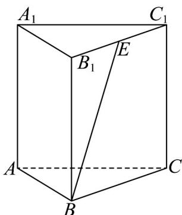

> [!faq]- 《专题04_空间中点线面关系的五大常考题型_高效培优专项训练_》官方解析
>
> > [!success]- **【答案】** 
>
> > [!note]- **【分析】**
> > 由异面直线定义得 $\angle B_{1}BE$ 为直线 $AA_{1}$ 与直线 $BE$ 所成角，接着求出当 $E$ 与 $B_{1}$ 重合和 $E$ 与 $C_{1}$ 重合时
> >
> > 直线 $AA_{1}$ 与直线 BE 所成角即可得解.
>
> > [!note]- **【解析】**
> > 由直三棱柱 $ABC - A_{1}B_{1}C_{1}$ ，所以 $AA_{1} / / BB_{1}$
> >
> > 所以 $\angle B_{1}BE$ 为直线 $AA_{1}$ 与直线 BE 所成角，
> >
> > 当 $E$ 与 $B_{1}$ 重合时，直线 $AA_{1}$ 与直线 $BE$ 所成角为0
> >
> > 当 $E$ 与 $C_1$ 重合时，直线 $AA_{1}$ 与直线 $BE$ 所成角为 $\frac{\pi}{4}$
> >
> > 所以直线 $AA_{1}$ 与直线 $BE$ 所成角的范围是 $\left[0, \frac{\pi}{4}\right]$ .
> >
> > 故答案为： $\left[0,\frac{\pi}{4}\right]$
