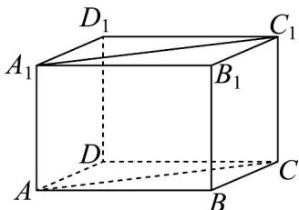

> [!faq]- 《专题04_空间中点线面关系的五大常考题型_高效培优专项训练_》官方解析
>
> > [!success]- **【答案】** A. $30^{\circ}$ B. $45^{\circ}$ C. $60^{\circ}$ D. $90^{\circ}$
>
> > [!note]- **【分析】**
> > 根据已知找到异面直线所成角的平面角，再根据已知求其大小即可.
>
> > [!note]- **【解析】**
> > 由长方体结构知 $AA_{1} // CC_{1}$ 且 $AA_{1} = CC_{1}$ ，则 $ACC_{1}A_{1}$ 为平行四边形，故 $AC // A_{1}C_{1}$ ，所以直线 $A_{1}C_{1}$ 和直线 BC 所成角，即为 $\angle ACB$ 或其补角，而 BC = 2，AC = 4， $AB = 2\sqrt{3}$ ，所以 $\cos \angle ACB = \frac{1}{2}$ ，则 $\angle ACB = 60^{\circ}$ .
> >
> > 
> >
> > 故选：C
> >
> > 题型五：空间中直线与平面位置关系
