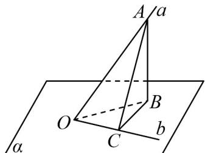

> [!faq]- 《专题04_空间中点线面关系的五大常考题型_高效培优专项训练_》官方解析
>
> > [!success]- **【答案】** A. $30^{\circ}$ B. $45^{\circ}$ C. $60^{\circ}$ D. $75^{\circ}$
>
> > [!note]- **【分析】**
> > 根据题意画出几何示意图，利用直线与平面的位置关系找出直线 a, b 所成的角即可求出其大小.
>
> > [!note]- **【解析】**
> > 设直线 $a$ 交平面 $\alpha$ 于点 $O$ ，在直线 $a$ 上任取一点 $A$ ，过点 $A$ 作平面 $\alpha$ 的垂线，垂足为 $B$ ，连接 $OB$ 则 $\angle AOB = 45^{\circ}$ ，
> >
> > 再过点 O 作直线 b，使得直线 b 与直线 OB 夹角为 $45^{\circ}$ ，过点 B 作 $BC \perp b$ ，垂足为 C，连接 AC，则 $\angle BOC = 45^{\circ}$ ，如图所示：
> >
> > 
> >
> > 易知 $AB \perp$ 平面 $\alpha$ ，直线 $b \subset$ 平面 $\alpha$ ，所以 $AB \perp b$
> >
> > 因为 $BC \perp b$ ， $BC \cap AB = B$ ， $BC, AB \subset$ 平面 ABC，所以 $b \perp$ 平面 ABC；
> >
> > 又因为 $AC \subset$ 平面 ABC ，所以 $AC \perp b$ ，可得 $\angle ACO = 90^{\circ}$
> >
> > 设 OB = m ，则 $OA = \sqrt{2}m$ ， $OC = \frac{\sqrt{2}}{2}m$ ，
> >
> > 所以在 Rt△AOC 中， $\cos\angle AOC=\frac{\frac{\sqrt{2}}{2}m}{\sqrt{2}m}=\frac{1}{2}$
> >
> > 因此 $\angle AOC = 60^{\circ}$
> >
> > 故选 **C**
