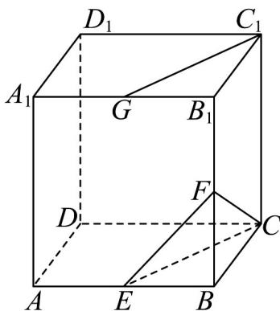

<!-- question-source:start -->
2．如图，在长方体 $ABCD-A_{1}B_{1}C_{1}D_{1}$ 中，E,F,G 分别是棱 $AB,BB_{1},A_{1}B_{1}$ 的中点.

(1)证明： $C_{1}G//$ 平面CEF.

(2)在棱 $AA_{1}$ 上是否存在点 $_{H}$ ，使得平面 $C_{1}GH//$ 平面 $CEF$ ？若存在，求出 $\frac{A_{1}H}{A_{1}A}$ 的值；若不存在，请说明理由.
<!-- question-source:end -->

![[高中/课堂同步/题库/人教A版高中数学同步讲义(2026)/02_必修第二册/第八章 立体几何初步/专项训练/专题05_线面位置关系的四大常考题型_高效培优专项训练_/题型一_sec_02/questions/answers/Q00065112A1.md]]
