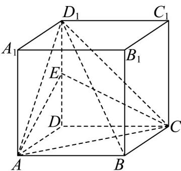

<!-- question-source:start -->
6. 如图，棱长为 2 的正方体 $ABCD - A_1B_1C_1D_1$ 中， $E$ 是 $DD_{1}$ 的中点.

(1)证明： $BD_{1}$ // 平面 ACE；

(2)求三棱锥 $D_{1}-AEC$ 的体积.
<!-- question-source:end -->

![[高中/课堂同步/题库/人教A版高中数学同步讲义(2026)/02_必修第二册/第八章 立体几何初步/专项训练/专题05_线面位置关系的四大常考题型_高效培优专项训练_/题型一_sec_02/questions/answers/Q00065116A1.md]]
