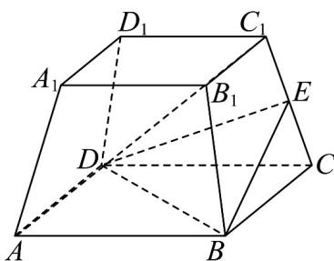

<!-- question-source:start -->
8．如图，正四棱台 $ABCD-A_{1}B_{1}C_{1}D_{1}$ 中，上底面边长为 $4\sqrt{2}$ ，下底面边长为 $8\sqrt{2}$ ，E 为 $CC_{1}$ 的中点，侧棱长为 6.

(1)证明： $AC_{1} //$ 平面 BDE；

(2)求该正四棱台的表面积.
<!-- question-source:end -->

![[高中/课堂同步/题库/人教A版高中数学同步讲义(2026)/02_必修第二册/第八章 立体几何初步/专项训练/专题05_线面位置关系的四大常考题型_高效培优专项训练_/题型一_sec_02/questions/answers/Q00065118A1.md]]
