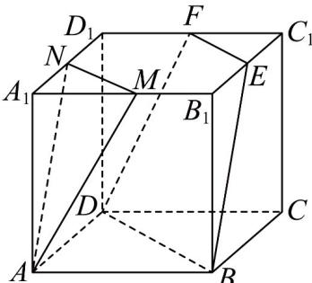

<!-- question-source:start -->
12．如图，在边长为2的正方体 $ABCD - A'B'C'D'$ 中， $M$ ， $N$ ， $E$ ， $F$ 都是正方体棱上的中点.

(1)求证平面 $AMN//$ 平面 $DBEF$ ;

(2)求三棱台 $CBD - C_{1}EF$ 的体积.
<!-- question-source:end -->

![[高中/课堂同步/题库/人教A版高中数学同步讲义(2026)/02_必修第二册/第八章 立体几何初步/专项训练/专题05_线面位置关系的四大常考题型_高效培优专项训练_/题型一_sec_02/questions/answers/Q00065122A1.md]]
