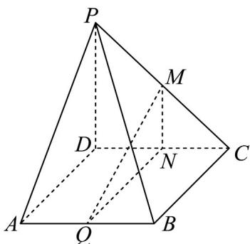

<!-- question-source:start -->
13．如图，四棱锥 P-ABCD 的底面为平行四边形. 设平面 PAD 与平面 PBC 的交线为 l, M、N、Q 分别为 PC、CD、AB 的中点.

(1)求证： $MQ / /$ 平面PAD；

(2)求证： $BC / / l$
<!-- question-source:end -->

![[高中/课堂同步/题库/人教A版高中数学同步讲义(2026)/02_必修第二册/第八章 立体几何初步/专项训练/专题05_线面位置关系的四大常考题型_高效培优专项训练_/题型一_sec_02/questions/answers/Q00065123A1.md]]
