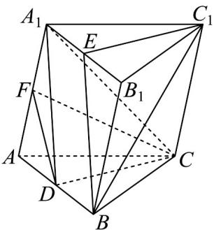

<!-- question-source:start -->
16．如图，在三棱柱 $ABC-A_{1}B_{1}C_{1}$ 中，D，E，F 分别是 AB， $A_{1}B_{1}$ ， $AA_{1}$ 的中点．

(1)求证：平面 $A_{1}DC \parallel$ 平面 $BEC_{1}$ ；

(2)求证：在 $BB_{1}$ 上存在一点 $P$ ，使得平面 $EC_{1}P / /$ 平面 $DCF$
<!-- question-source:end -->

![[高中/课堂同步/题库/人教A版高中数学同步讲义(2026)/02_必修第二册/第八章 立体几何初步/专项训练/专题05_线面位置关系的四大常考题型_高效培优专项训练_/题型一_sec_02/questions/answers/Q00065126A1.md]]
