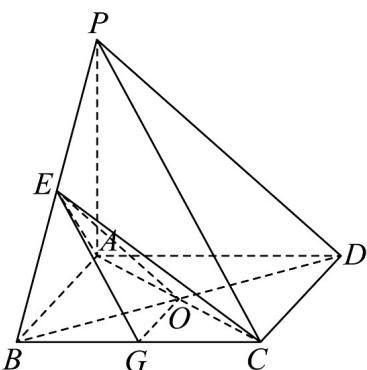

<!-- question-source:start -->
18．如图，在四棱锥 P-ABCD 中，四边形 ABCD 是平行四边形，AC,BD 交于点 O，点 E 是棱 PB 上的一点，且 PD// 平面 EAC．

(1)求证：点 $E$ 是 $PB$ 的中点；

(2)在棱 $BC$ 上是否存在点 $G$ ，使得平面 $EOG//$ 平面 $PCD$ ？若存在，请加以证明，并写出 $\frac{BG}{BC}$ 的值；若不存在，请说明理由。
<!-- question-source:end -->

![[高中/课堂同步/题库/人教A版高中数学同步讲义(2026)/02_必修第二册/第八章 立体几何初步/专项训练/专题05_线面位置关系的四大常考题型_高效培优专项训练_/题型一_sec_02/questions/answers/Q00065128A1.md]]
