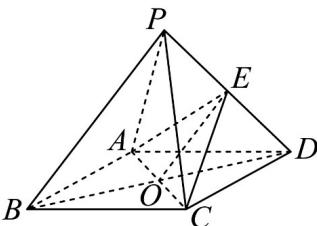

> [!faq]- 《专题05_线面位置关系的四大常考题型_高效培优专项训练_》官方解析
>
> > [!success]- **【答案】** (1)证明见解析 (2) $\frac{1}{2}$
>
> > [!note]- **【分析】**
> > （1）连接 BD 交 AC 于 O，且连接 OE，即证 OE∥PB，利用线面平行的判断定理即可求解；
> >
> > (2) 先求点 $E$ 到平面 $ACD$ 的距离，再求底面面积，根据三棱锥的体积公式即可求解.
>
> > [!note]- **【解析】**
> > （1）连接 $BD$ 交 $AC$ 于 $O$ ，且连接 $OE$ ，则 $O$ 为 $AC$ 的中点.
> >
> > 
> >
> > 因为 E 是 PD 的中点，所以 OE 为 $\triangle PBD$ 的中位线，所以 $OE \parallel PB$ ，又因为 $PB \not\subset$ 面 ACE， $OE \subset$ 面 ACE，所以 $PB \parallel$ 面 ACE
> >
> > (2) 因为 $PA = PC$ ， $O$ 为 $AC$ 的中点，所以 $PO \perp AC$ ，又因为 $PB = PD$ ，所以 $PO \perp BD$ ，因为 $AC$ ， $BD \subset$ 面 $ABCD$ ， $AC \cap BD = O$ ，所以 $PO \perp$ 面 $ABCD$ ，菱形 $ABCD$ 中， $\angle ABC = 60^{\circ}$ ， $AB = 2$ ，所以 $AC = 2$ ，所以 $OC = 1$
> >
> > 因为 $E$ 为 $PD$ 的中点，所以点 $E$ 到面 $ABCD$ 的距离为 $\frac{1}{2} PO = \frac{1}{2}\sqrt{PC^2 - OC^2} = \frac{1}{2}\sqrt{4 - 1} = \frac{\sqrt{3}}{2}$ 又 $S_{\triangle ACD} = \frac{1}{2} AD\cdot CD\cdot \sin \angle ADC = \frac{1}{2}\times 2\times 2\times \frac{\sqrt{3}}{2} = \sqrt{3}$ 所以 $V_{E - ACD} = \frac{1}{3} S_{\triangle ACD}\cdot \frac{1}{2} PO = \frac{1}{3}\times \sqrt{3}\times \frac{\sqrt{3}}{2} = \frac{1}{2}$ 所以三棱锥 $E - ACD$ 的体积为 $\frac{1}{2}$ ：
