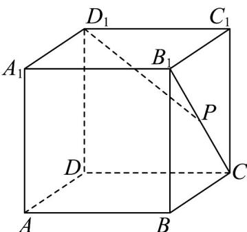
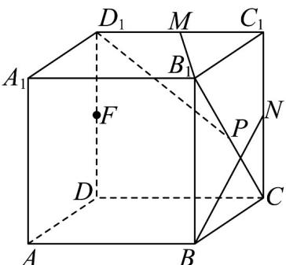
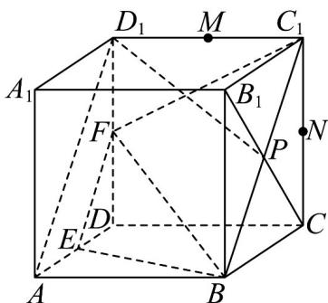
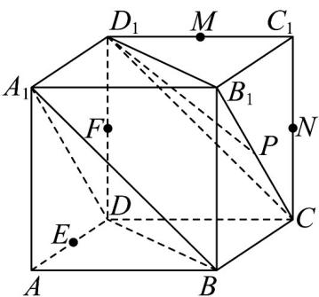
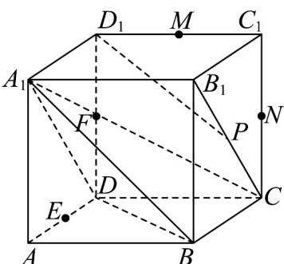

> [!faq]- 《专题05_线面位置关系的四大常考题型_高效培优专项训练_》官方解析
>
> > [!success]- **【答案】**  A. 直线 $BN$ 与 $MB_{1}$ 是异面直线 B. 过 $B, E, F$ 三点的平面截正方体所得截面图形是菱形 C. $D_{1}P//$ 平面 $A_{1}BD$ D．四面体 $A_{1} - BCD$ 的高可以为1
>
> > [!note]- **【分析】**
> > 对于 A，由异面直线的定义判断即可；对于 B，说明过 B, E, F 三点的平面截正方体所得截面图形是梯形 $EBC_{1}F$ 即可判断；对于 C，说明平面 $A_{1}BD//$ 平面 $B_{1}CD_{1}$ ，结合面面平行的性质即可判断；对于 D，由 $AA_{1} \perp$ 平面 BCD 即可判断.
>
> > [!note]- **【解析】**
> > 对于 A，如图所示，
> >
> > 
> >
> > 由于 $BN \subset$ 平面 $BB_{1}C_{1}C, MB_{1} \cap$ 平面 $BB_{1}C_{1}C = B_{1}, B_{1} \notin BN$
> >
> > 故直线 BN 与 $MB_{1}$ 是异面直线，故 A 正确；
> >
> > 对于 B，如图所示，
> >
> > 
> >
> > 因为 $E, F$ 分别是 $AD, DD_{1}$ 的中点，所以 $EF // AD_{1}$
> >
> > 在正方体中，因为 $AB // C_1 D_1, AB = C_1 D_1$ ，所以四边形 $ABC_1 D_1$ 为平行四边形，所以 $AD_1 // BC_1$ ，所以 $EF // BC_1$ ，
> >
> > 所以过 $B, E, F$ 三点的平面截正方体所得截面图形是梯形 $EBC_{1}F$ ，故 B 错误；对于 C，如图所示，
> >
> > 
> >
> > 连接 $A_{1}B, A_{1}D, BD$
> >
> > 因为 $BB_{1} // DD_{1}, BB_{1} = DD_{1}$ ，所以四边形 $BB_{1}D_{1}D$ 是平行四边形，同理可证四边形 $A_{1}B_{1}CD$ 是平行四边形，所以 $BD // B_{1}D_{1}, A_{1}D // B_{1}C$ ，因为 $A_{1}D \subset$ 平面 $A_{1}BD, B_{1}C \subset$ 平面 $A_{1}BD$ ，所以 $B_{1}C //$ 平面 $A_{1}BD$ ，因为 $BD \subset$ 平面 $A_{1}BD, B_{1}D_{1} \subset$ 平面 $A_{1}BD$ ，所以 $B_{1}D_{1} //$ 平面 $A_{1}BD$ ，又 $B_{1}D_{1} \cap B_{1}C = B_{1}, B_{1}D_{1}, B_{1}C \subset$ 平面 $B_{1}CD_{1}$ ，故平面 $A_{1}BD //$ 平面 $B_{1}CD_{1}, \because D_{1}P \subset$ 平面 $B_{1}CD_{1}, \therefore D_{1}P //$ 平面 $A_{1}BD$ ，故 C 正确；
> >
> > 对于 D，如图所示，
> >
> > 
> >
> > 因为 $A_{1}A \perp$ 面 $BCD$ ，且 $A_{1}A = 1$ ，所以四面体 $A_{1} - BCD$ 的高可以为1，故D正确，
