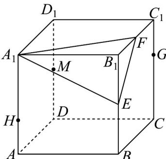
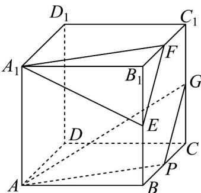
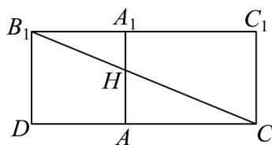
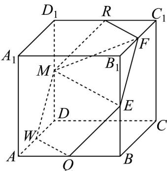

> [!faq]- 《专题05_线面位置关系的四大常考题型_高效培优专项训练_》官方解析
>
> > [!success]- **【答案】**  A. 当 $G$ 为棱 $CC_{1}$ 中点时，直线 $AG / /$ 平面 $A_{1}EF$ B. 三棱锥 $B_{1} - A_{1}EF$ 外接球的表面积为 $24\pi$ C. 若 $H$ 是棱 $AA_{1}$ 上的动点，则 $D_{1}H + CH$ 的最小值为 $\sqrt{16 + 8\sqrt{2}}$ D. 若 $M$ 为棱 $DD_{1}$ 的中点，平面 $MEF$ 截正方体所得截面图形的周长为 $6\sqrt{2}$
>
> > [!note]- **【分析】**
> > A 选项，作出辅助线，得到 $EF //$ 平面 $APG$ ， $A_{1}F //$ 平面 $APG$ ，得到面面平行，进而得到线面平行；B 选项，三棱锥 $B_{1} - A_{1}EF$ 外接球为以 $A_{1}B_{1}, B_{1}E, B_{1}F$ 三边为长宽高的长方体的外接球，从而求出外接球半径和表面积；C 选项，将两平面展开到同一平面内，利用勾股定理求出最小值；D 选项，作出平面 $MEF$ 截正方体所得截面图形，求出周长.
>
> > [!note]- **【解析】**
> > A 选项，取 BC 的中点 P，又 G 为棱 $CC_{1}$ 中点，E，F 分别是棱 $BB_{1}$ ， $B_{1}C_{1}$ 的中点，故 GP // EF， $AP // A_{1}F$ ，
> >
> > 因为 $GP \subset$ 平面 $APG$ ， $EF \notin$ 平面 $APG$ ，所以 $EF //$ 平面 $APG$ ，
> >
> > 同理可得 $A_{1}F / /$ 平面APG
> >
> > 因为 $EF \cap A_{1}F = F$ ， $EF, A_{1}F \subset$ 平面 $EA_{1}F$
> >
> > 所以平面 $EA_{1}F / /$ 平面APG
> >
> > 因为直线 $AG \subset$ 平面 APG，所以 $AG \parallel$ 平面 $EA_{1}F$ ，A 正确；
> >
> > 
> >
> > B 选项，显然 $A_{1}B_{1}, B_{1}E, B_{1}F$ 两两垂直，
> >
> > 故三棱锥 $B_{1} - A_{1}EF$ 外接球为以 $A_{1}B_{1}, B_{1}E, B_{1}F$ 三边为长宽高的长方体的外接球，
> >
> > 设外接球半径为 $r$ ，则 $r = \frac{1}{2}\sqrt{A_1B_1^2 + B_1E^2 + B_1F^2} = \frac{1}{2} \times \sqrt{4 + 1 + 1} = \frac{\sqrt{6}}{2}$ ，
> >
> > 故外接球表面积为 $4\pi \left(\frac{\sqrt{6}}{2}\right)^2 = 6\pi$ ，B错误；
> >
> > C 选项，将正方形 $A_{1}D_{1}DA$ 和矩形 $A_{1}C_{1}CA$ 沿着棱 $A_{1}A$ 展开，如图，
> >
> > 
> >
> > 连接 $D_{1}C$ 与 $A_{1}A$ 相交于点 $H$ ， $D_{1}H + CH$ 的最小值即为 $D_{1}C$ 的长度，
> >
> > 其中 $D_{1}D = 2$ ， $DC = DA + AC = 2 + 2\sqrt{2}$
> >
> > 由勾股定理得 $D_{1}C = \sqrt{D_{1}D^{2} + DC^{2}} = \sqrt{4 + (4 + 8\sqrt{2} + 8)} = \sqrt{16 + 8\sqrt{2}}$ ，C正确；
> >
> > D 选项，取 AD 的中点 W，AB 的中点 Q， $D_{1}C_{1}$ 的中点 R，
> >
> > 连接 MR, RF, EQ, QW, WM，可证得 $RF // ME // WQ$ ，M, R, F, E, Q, W 六点共面，
> >
> > 
> >
> > 平面 $MEF$ 截正方体所得截面图形即为正六边形 $MRFEQW$ ，边长为 $\sqrt{2}$
> >
> > 故周长为 $6\sqrt{2}$ ，D正确.
> >
> > 故选 **ACD**
